# Take Control

Developer: Georgina Carlisle

Image of application to go here

A task management application that allows users to set, manage and organise their focus areas, goals and tasks. Created using React alongside linked Django Rest API.

Links:
[Take Control App live](https://take-control-frontend-32659c908a57.herokuapp.com/)
[Take Control API live](https://take-control-api-d106d6135431.herokuapp.com/)
[Take Control API repository](https://github.com/GeorginaCarlisle/take-control-api)

## Contents

[Features](#features)

- [Existing Features](#existing-features)

- [Future Features](#future-features)

[Design](#design)

- [The Strategy Plane](#the-strategy-plane)

- [The Scope Plane](#the-scope-plane)

- [The Structure Plane](#the-structure-plane)

- [The Skeleton Plane](#the-skeleton-plane)

- [The Surface Plane](#the-surface-plane)

[Agile Methodology](#agile-methodology)

[Languages](#languages)

[Frameworks and Libraries](#frameworks-and-libraries)

[Tools and Technologies](#tools-and-technologies)

[Testing and Validation](#testing-and-validation)

[Bugs and Fixes](#bugs-and-fixes)

[Deployment](#deployment)

[Cloning this repository](#cloning-this-repository)

[Forking a branch](#forking-a-branch)

[Connecting to the Take Control API](#connecting-to-the-take-control-api)

[Credits](#credits)

[Acknowledgements](#acknowledgements)

---

## Features

### Existing Features

### Future Features

[Return to contents list](#contents)

## Design

### The Strategy Plane

#### Target User Group

Adults who are wanting to take control and push forwards in their life. Setting goals, making progress and keeping on top of everything they wish to achieve.
The target group often have lots on their plate and want to be able to keep multiple plates spinning.

#### Problem Background

For those with a full life, lots on their plate and lots they want to achieve, it can be hard to keep track of everything and despite determination and hard work things start to slip and get missed. It can be difficult to prioritise and manage everything in a way that allows for balance and progression across multiple areas. Without a way to keep organised their focus can jump from area to area, with long-term consistency difficult to maintain and any progression made easily lost.

#### Problem Statement

“I am a busy individual who is finding it difficult to keep track of everything I need to do and all the extra things that will enable me to progress and push forwards.”

#### Project Aim

To provide users with an application that allows them to store and manipulate data that:

- identifies the different focus areas in their life
- sets goals
- notes tasks to be undertaken (one off and repeated)
- allows for organisation and prioritisation
- allows for tracking and deadline setting

#### Safety Considerations

User’s data needs to be kept safe. Viewable and editable by them alone. The code behind the application also needs to be kept safe with secret keys etc. hidden.

[Return to contents list](#contents)

### The Scope Plane

This project will provide a secure front-end application which will allow users to easily create and interact with their data (see user stories below). Data will be stored securely in a backend database, controlled and served by an API.

[Link to Take Control API](https://github.com/GeorginaCarlisle/take-control-api)

User Stories which detail the scope of this project from the users point of view have been organised by epic.

#### Epic - New User Experience

1 - As a new user, I can instantly see information about the application, so that I can understand the value that it may offer me.

2 - As a new user, I can find out more about the planning side of the application, so that I can learn more about how the application works enticing me to sign up.

3 - As a new user, I can find out more about the take action side of the application, so that I can learn more about how the application works enticing me to sign up.

#### Epic - Navigation

4 - As a user, a clear navigation bar is present throughout the site, so that I can navigate easily between different sections of the application.

5 - As a user, the navigation bar contains links which are specific to whether I am logged in or logged out, so that all available links are relevant and accessible to me.

6 - As a user, navigation between different sections of the website is seamless without un-necessary page refreshing, so that I can navigate quickly around the site.

7 - As an authorised user, all sub pages include an x that will return me to my previous page on clicking, so that I can easily check things out and then return to where I was.

8 - As an authorised user, clicking on a task within the ‘take action’ page will take me to the ‘plan’ page where that task is located.

#### Epic - Authentication

9 - As a new user, I can easily set up an account, so that I can quickly get stuck into exploring and using the application.

10 - As a signed-up user, I can use my username and password to sign in to my account, so that my account remains secure and only I can login.

11 - As a signed-up user, I am the only one who can access my data, so that it remains safe and secure.

12 - As a signed-up user, I can reset my password, so that I can still access my account even if I have forgotten my password.

13 - As an authenticated user, I can easily logout of my account, so that I can keep my account secure.

14 - As an authenticated user, I can maintain my authenticated status until I choose to log out, so that I am not unexpectedly logged out due to expired access tokens.

15 - As an authenticated user, I can edit my user information, so that I can make changes to my username and password, helping me to keep my account secure.

16 - As an authenticated user, I can delete my data including my user data, so that I can remove all my data from the system should I wish to.

#### EPIC - Focus areas

17 - As an authenticated user, I can create focus areas, so that I can set out the different areas in my life that I want to use this app to support with and why each area is important to me.

18 - As an authenticated user, I can edit a focus area, so that I can make changes should I wish.

19 - As an authenticated user, I can delete a focus area, so that I can remove information I no longer need or want.

#### EPIC - Goals

20 - As an authenticated user, I can create goals that are linked to a focus area, so that I can set myself progression targets that are specific, measurable, achievable, reachable and time-bound, defining the value to be gained in achieving the goal.

21 - As an authenticated user, I can create goals within goals, so that I can break up large goals into more achievable chunks.

22 - As an authenticated user, I can edit a goal so that I can make changes should I wish.

23 - As an authenticated user, I can delete a goal, so that I can remove information I no longer need or want.

#### EPIC - Tasks

24 - As an authenticated user, I can create tasks linked directly to a focus area, so that I can set out day to day tasks associated with that area.

25 - As an authenticated user, I can create tasks linked to a goal, so that I can set out the steps I will need to take to achieve my goal.

26 - As an authenticated user, I can create unlinked tasks, so that I can include any tasks not directly linked to a set focus area or goal.

27 - As an authenticated user, I can edit a task, so that I can make changes should I wish.

28 - As an authenticated user, I can delete a task, so that I can remove information I no longer need or want.

29 - As an authenticated user, I can set tasks to be repeated, so that I can easily include habitual tasks.

#### EPIC - Plan

30 - As an authenticated user, I can view all my focus areas and their nested goals together on one page, so that I can see and manage the bigger picture of everything I have going on.

31 - As an authenticated user, I can view all the goals and tasks within a given focus area together, helping me to plan how I wish to move forwards in this area and everything that is need to achieve that progression.

32 - As an authenticated user, I can view all my miscellaneous tasks together in one place, so that I can plan tasks that don't link to any of my focus areas.

#### EPIC - Informed User

33 - As an authenticated user, I receive a success message on creation, editing and deleting, so that I know my action was successful.

34 - As an authenticated user, I receive a confirmation message on clicking to delete, so that I am made aware of any linked information that will also be deleted should I proceed and can avoid any accidental deletes.

35 - As an authenticated user, I receive a confirmation message when an action will result in form input updates remaining unsaved, so that I don’t accidentally lose data I meant to save.

#### EPIC - Take Action

36 - As an authenticated user, I can view all active tasks together in a take action page, so that I can plan and organise my day.

37 - I can click to reset the Action page, deleting one-off completed tasks and returning everything else to the backlog, so that I can start afresh each day.

#### EPIC - Backlog

38 - As an authenticated user, I can view all my pending tasks within a backlog list, so that I can easily see everything to be done altogether.

39 - As an authenticated user, I can activate and pause goals, so that only tasks from goals I actively want to work on are added to the backlog.

40 - As an authenticated user, I can order tasks in the backlog by repeated, focus, deadline, most recent, least recent, day to day or goal, so that I can set up the backlog in a way that works for me.

41 - As an authenticated user, I can quickly add new tasks to the backlog without needing to go through the planning page, so that I can quickly and easily add additional tasks.

42 - As an authenticated user, I can rank my focus areas by importance, so that goals and tasks associated with this area will appear at the top of the backlog.

#### EPIC - Today

43 - As an authenticated user, I can toggle tasks to work on today moving them into a today list, so that I can prioritise and organise what I want to achieve today.

44 - As an authenticated user, I can order tasks in today, so that tasks are displayed in the order I intend to work through them.

#### EPIC - Completed

45 - As an authenticated user, I can toggle tasks as completed moving them to a completed list, so that I can see exactly what I have achieved.

#### EPIC - Labels

46 - As an authenticated user, I can create custom labels, so that I can categorise my tasks.

47 - As an authenticated user, I can edit custom labels, so that I can make changes should I wish.

48 - As an authenticated user, I can delete custom labels, so that I can remove any unneeded labels helping me to maintain an uncluttered system.

49 - As an authenticated user, I can add custom labels to my tasks, so that I can set up my own system to aid with prioritisation.

#### Epic - Tracking

50 - As an authenticated user, where I have set a deadline, the app calculates how long I have left in easy terms (weeks initially and then days), so that I can make sure I meet my deadlines.

51 - As an authenticated user, when my deadlines are near the associated tasks are highlighted, so that my attention is drawn to tasks that I need to prioritise in order to meet my deadlines.

52 - As an authenticated user, where I have repeated tasks, the app keeps track of how many I have completed for the set time period, so that I know whether the task is due or not.

53 - As an authenticated user, repeated tasks that need to be completed today in order to achieve the set frequency are highlighted, so that my attention is drawn to the task helping me to keep on top of repeat jobs or habits I am trying to form.

54 - As an authenticated user, tasks that have been awaiting completion for a long time are highlighted, so that my attention is drawn to them helping me to weed out tasks as well as not leaving important things undone.

55 - As an authenticated user, goals that haven’t had any tasks or tasks of nested goals completed are highlighted, so that my attention is drawn to them helping me to weed out goals that are no longer important as well as not leaving important goals undone.

#### Epic - Teams

56 - As an authenticated user, I can set up a team of other users who I would like to grant access to my data, so that I can use the app for shared goals and tasks.

57 - As an authenticated user, I can grant write access to all goals and tasks nested within a focus area to members of my team, so that they can contribute to the organisation and management of goals and tasks within this focus.

58 - As an authenticated user, I am grant read access to all goals and tasks nested within a focus area to members of my team, so that they can see what I am working on.

[Return to contents list](#contents)

### The Structure Plane

The following diagram shows the main features within the application and the user's path through these.

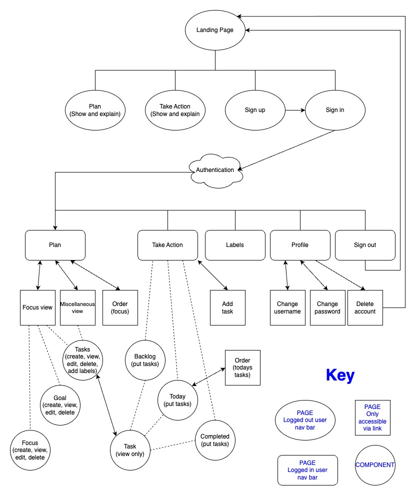

A [Component Plan](documentation/planning/component-plan.pdf) has been created showing how React components will be used to achieve this structure. This plan is designed as a starting point that will be further adapted as the project is being built and also contains notes on some of the key functionality.

For backend structure please see the [Take Control API README](https://github.com/GeorginaCarlisle/take-control-api?tab=readme-ov-file#design).

[Return to contents list](#contents)

### The Skeleton Plane

A number of wireframes have been created to plan out how and where everything will be displayed. The final layout will be further developed during the build phase. Any changes will be noted in the [features](#features) section.

#### Landing Page

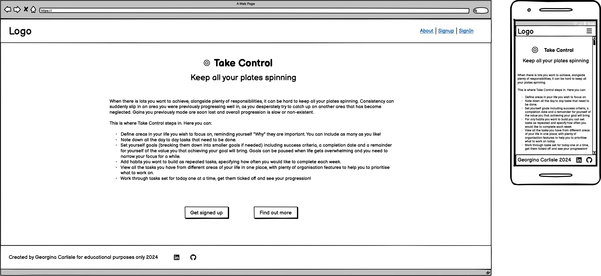

#### Main plan page

This is where users will first be taken when they log in.

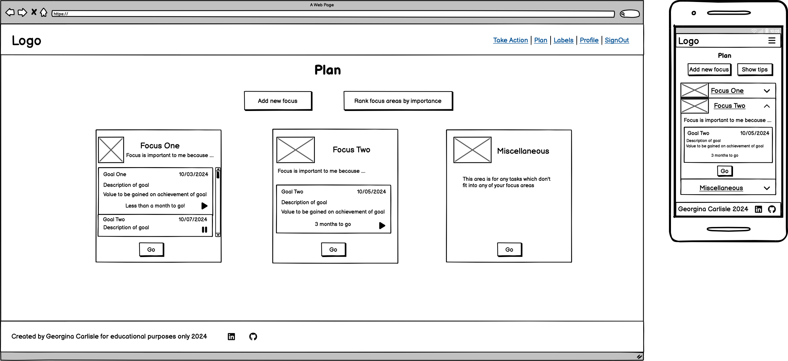

#### Focus page

The focus page is accessed through the plan page and includes a number of components, all of which can be rendered in create, view, or edit modes. Three wireframes have been included to show these different variations.

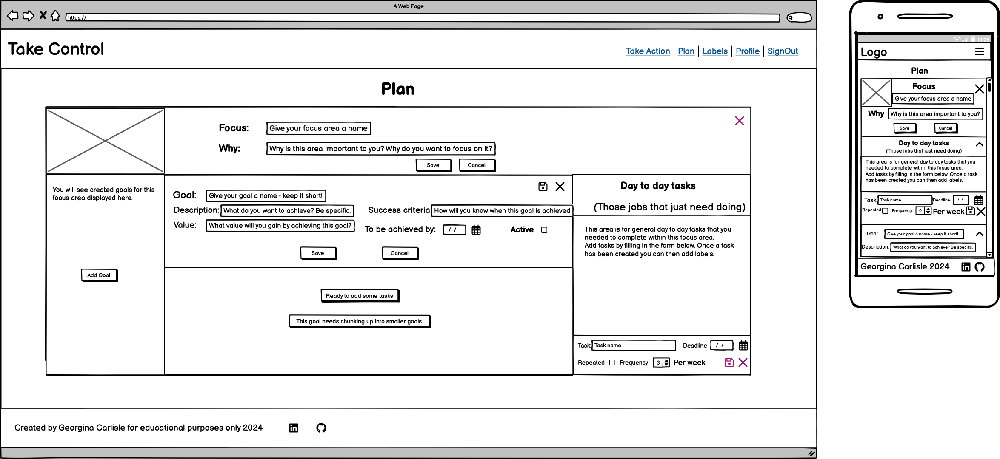

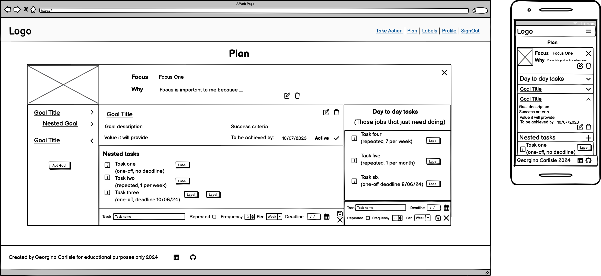

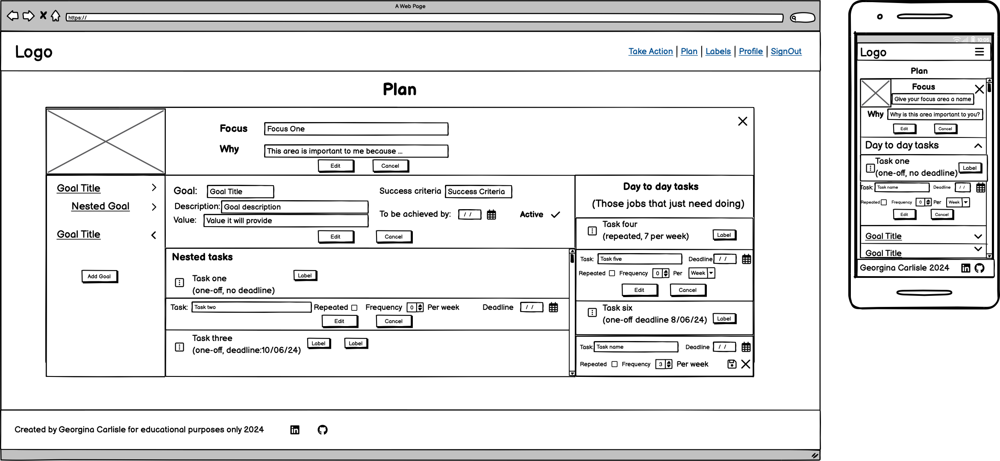

#### Miscellaneous page

This is page for unlinked tasks and is accessed from the main plan page. It will also handle editing in the same manner as the focus page.

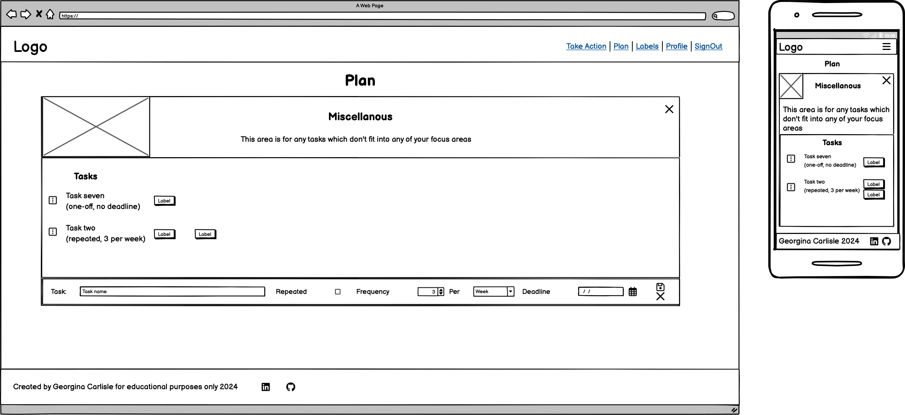

#### Take Action page

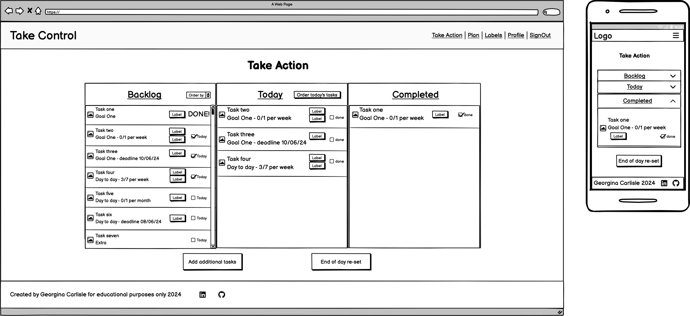

#### Labels page

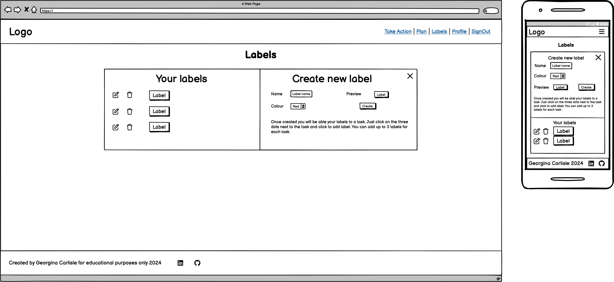

Once labels have been created, they can be added in the Take Action page.

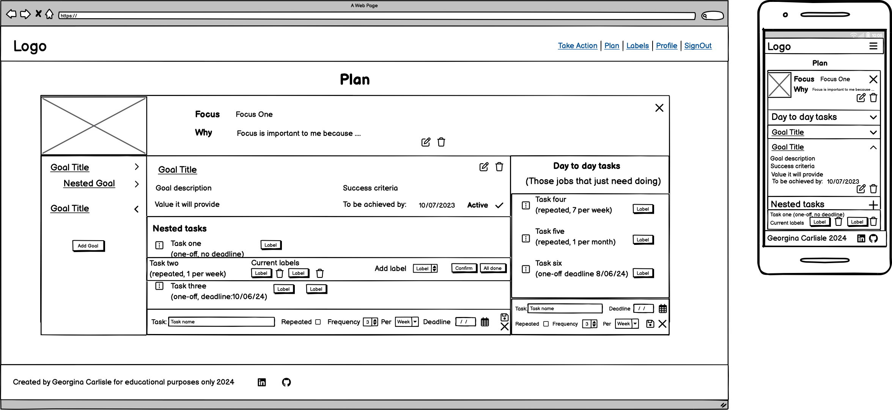

#### Ordering page

This wireframe shows today's tasks being ordered. The same setup will also be used for ranking focus areas.

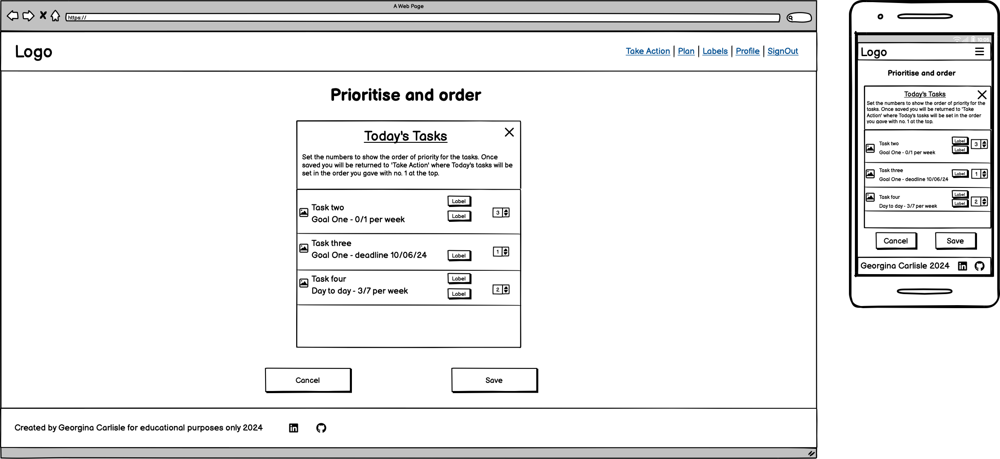

#### New task page

The new task page provides a quick way of creating new tasks that is accessed directly from the take action page.

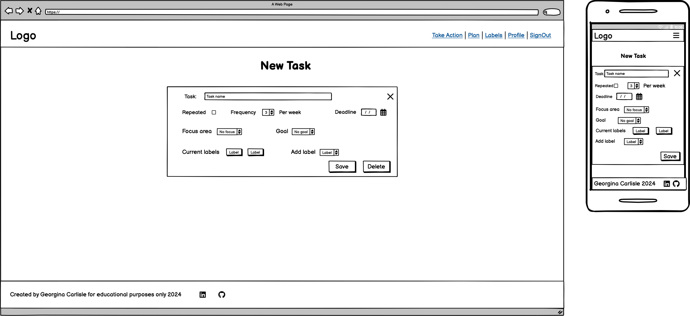

[Return to contents list](#contents)

### The Surface Plane

#### Aims

The aim for the surface plane is to provide a clean, relaxed and professional space.

There will often be a lot on the screen, the vast majority of which will be text and so white space, clearly defined containers and use of colour will be key to helping the user navigate around the information.

The application contains a lot of interaction through which the user will manipulate their data. Common icons will be used helping to maintain a clean and uncluttered site. Only well-known icons will be used, aiding intuitive navigation of the site, aria-labels and hover labels will also be added to make these accessible to all. Where buttons are used, they will follow consistent styling.

The application needs to provide a great user experience on both mobile and desktop, so that it can be used will the user is working on a desktop as well as throughout the day via mobile.

#### Accessibility

The following will be utilised to increase the accessibility of this application:

- Semantic html to pass on clear meaning at a base level.
- High text colour contrast throughout. With all text passing both WCAG AA and WCAG AAA for their text size.
- Aria labels, alt text and aria-hidden to ensure visual information will be correctly passed on for those who cannot access it.
- Space around clickable elements on mobile, so that it is easy for users to activate the correct functionality when using a touch screen.

#### Frameworks and libraries to support styling

[React bootstrap](https://react-bootstrap-v4.netlify.app/) will be used to speed up styling and allow time to be focused on functionality. Bootstrap’s grid system will be used to control responsivity. The following components from bootstrap will also be used and modified as needed:

- Alerts (for success and error messages)
- Accordion (for mobile views)
- Badges (for labels)
- Buttons (for form submission etc.)
- Cards (for focus cards)
- Dropdowns (for mobile nav and task choices)
- Forms (for create and edit functionality)
- List Group (throughout)
- NavBar and Nav (for main navigation)
- Overlay/Popovers/tooltips (for hover info on functional items)
- Spinners (for indicating data loading)

[React drop and drag](https://react-dnd.github.io/react-dnd/about) will be considered for improving user experience by allowing users to drag tasks from backlog to today and then from today to completed, rather than a more clunky toggle system. It will also then be used for ordering of today tasks and ranking focuses. As this will involve upskilling, it will only be used should time allow.

#### Colour Scheme

The following colours have been chosen:
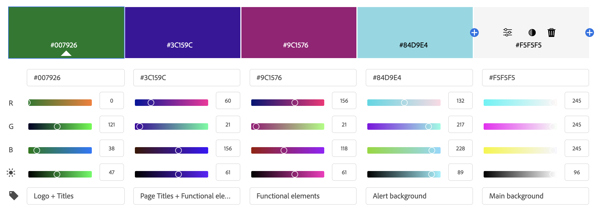

The main sections of the page will be given different background colours to help differentiate them as different:

- Header (light grey)
- Main background (Green – with low opacity)
- Page component (very light grey)
- Footer (dark grey with white text)
- Alert messages (light blue)

The main text will be black with colour being used for the following to aid navigation and page scanning:

- Logo + section titles (Green)
- Page title and current page in nav bar (Purple)
- Clickable elements (Pink)
- Clickable elements on hover (Purple)

Please see [TESTING.md](TESTING.md) for contrast level tests.

#### Font choices

For the application name and page titles [Bebas Neue by Ryoichi Tsunekawa](https://fonts.google.com/specimen/Bebas+Neue?preview.text=Take%20Control&classification=Display&stroke=Sans+Serif) has been chosen as it gives a real feeling of strength and taking control.

For the main text [Lato by Lukasz Dziedzic](https://fonts.google.com/specimen/Lato?query=Lato) has been chosen as it has a very clean and relaxed feel to it fitting in with the aims for the surface plane. It also has a number of styles within it providing scope to change the weight of the font etc.

#### Logo

A logo image has been created, incorporating the main green colour and the idea of a spinning plate made up of different elements. This logo will sit alongside the app name “Take Control” and slogan “Keep all your plates spinning” and will be used as the favicon.

[Return to contents list](#contents)

## Agile Methodology

Agile values and principles have been followed in the creation of this project where they fit into a solo project built purely for educational purposes within a very short timescale.

In particular the following common Agile practices have been followed: user stories, product backlog, time boxing, prioritization and information radiators.

### User Stories

Please see the [Scope Plane](#the-scope-plane) for the user stories created for this project which breakdown the Epics detailing the main features of the platform into manageable chunks of work.

The issues tool on GitHub has been used to record all user stories. Acceptance criteria and tasks were added to the user stories as the project progressed.

### MoSCoW Prioritisation

Due to the short time frame in which to build this project all user stories were given a MoSCoW label at the very beginning of the development phase:

Must-have - the user stories deemed vital for this phase of the project.

Should-have - the user stories deemed important but not vital for this phase of the project.

Could-have - the user stories that will only have a small impact if left out of this phase of the project.

Throughout the development phase I worked on completing all must-haves before assessing to see if I had time for should-haves and could-haves. As I progressed through the time available for completion of this project, I then began to re-categorised some of the user stories into:

Won't-have - the user stories that won't be worked on during this phase of the project, forming future features for the project.

### Information Radiator

GitHub projects was utilised as a kanban board for this project and was linked to both this repository and the [Take Control API repository](https://github.com/GeorginaCarlisle/take-control-api). This allowed both frontend and backend tasks to be viewed together and worked on in an order that allowed me to push for the best overall product that could be achieved within the time frame.

### Product Backlog

A product backlog was used in which to store all user stories, prior to being assigned into an iteration. Any user stories not completed at the end of the iteration were then moved back into the backlog. At the end of the project a number of user stories remained in the product backlog. These have been discussed in the [future features](#future-features) section of the readme.

The product backlog is visible on GitHub through the use of a specific backlog column in the project board.

### Time Boxing

Developement of the project was split into four time boxes/iterations. Each iteration was set to a period of one week and had a set focus. This allowed for judgements to be made for each task as to how far to push perfection and how quickly to move on, so that I was able to bring the project together into a finished state prior to the deadline.

#### First Sprint

Focus: Getting everything set up and initial deployment of both repositories before beginning API must-haves.

Beginning of the sprint:
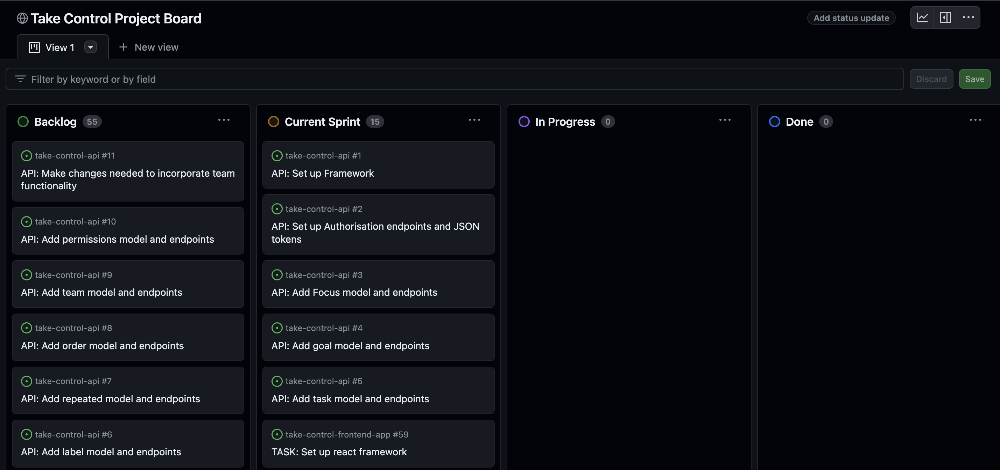

End of the sprint:
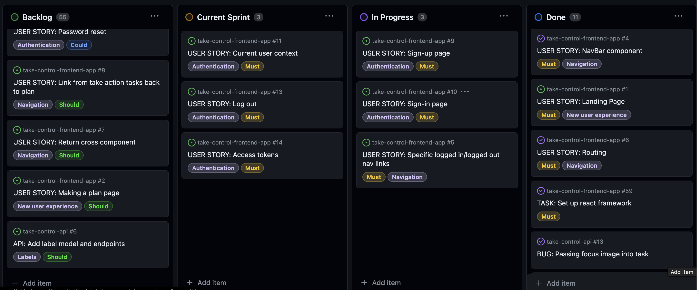
Notes: I was able to push on further than first anticipated and added further user stories into this sprint.

Finished tasks for the API:
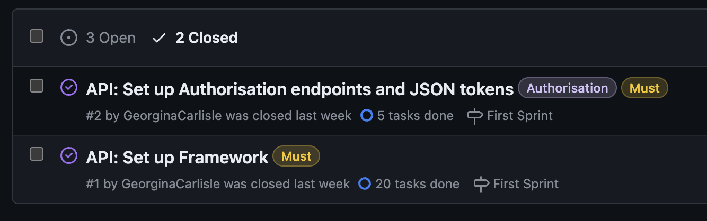

Open tasks for the API:

Note: The above tasks have been completed, however as there have been issues manually testing PUT, PATCH and DELETE endpoints they remain open until these have been fully tested via the frontend. See [manual testing information](https://github.com/GeorginaCarlisle/take-control-api/blob/main/TESTING.md#manual-testing) for more details.

Finished tasks for the frontend:
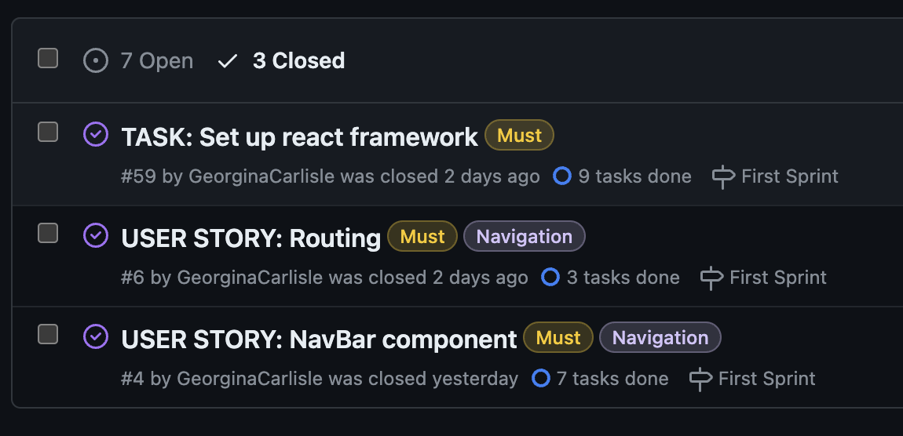

Open tasks for the frontend:
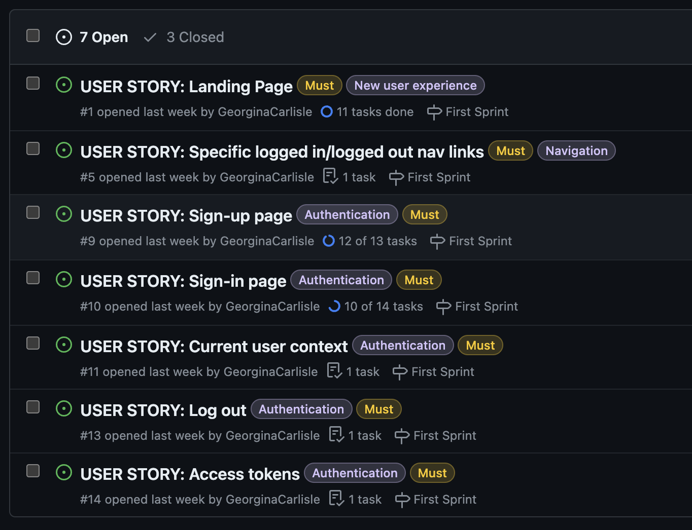
Note: The Landing Page user story is completed for this stage of the project and will be further enhance at the end. The sign-up and sign-in pages just need to generate a success message in order to be completed.

#### Second Sprint

Focus: Working through the must-haves for the frontend and checking that all api endpoints are working correctly when accessed via the frontend.

Beginning of the sprint:
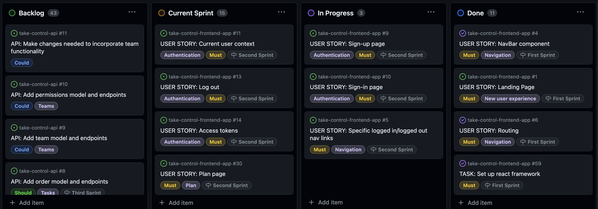

#### Third Sprint

Focus: All must-haves to be completed. A decision to then be taken on what else can be achieved in the remainder of this sprint.

#### Fourth Sprint

Focus: Final testing and README tasks alongside ensuring any remaining bugs are fixed.

[Return to contents list](#contents)

## Languages

HTML, CSS, JavaScript and JSX

[Return to contents list](#contents)

## Frameworks and Libraries

[React 17.0.2](https://legacy.reactjs.org/docs/getting-started.html) - A JavaScript library for building user interfaces. An older version was chosen to stay inline with all other dependencies used as part of the Moments walkthrough which provided a base that this project was then modelled on.

[React bootstrap 1.6.3](https://react-bootstrap.github.io/) - A frontend framework built for react that provides common components. React bootstrap was chosen to help speed up the development of this project and allow time to focused elsewhere.

[React Router 5.3.0](https://github.com/remix-run/react-router) - A lightweight, fully-featured routing library for React.

[Axios](https://axios-http.com/) - A simple promise based HTTP client for the browser and node.js.

[jwt-decode 3.1.2](https://www.npmjs.com/package/jwt-decode) - Used to decode the JSON web tokens.

[Return to contents list](#contents)

## Tools and Technologies

### Tools and technologies used to aid with planning

[Drawio](https://www.drawio.com/) - Used to create the flow diagram showing how the user will move through the website.

[Balsamiq](https://balsamiq.com/) - Used to create wireframes showing the skeleton plane of the design phase.

[Material - Palette configuration tool](https://m2.material.io/inline-tools/color/) - Used to generate colour scheme ideas.

[Adobe](https://color.adobe.com/create/color-wheel) - Used to create the colour scheme image.

### Tools and technologies used to aid with the coding of this project

[Code Institute Template](https://github.com/new?template_name=react-ci-template&template_owner=Code-Institute-Org) - Provided me with a familiar base from which to build my project.

[GitHub](https://github.com/)  - Stores the repository for this project so that it can be viewed by others. Github issues and projects were also utilised, see [Agile Methodology](#agile-methodology).

[git](https://git-scm.com/) - Controlled the building of this project in a series of versions which can be tracked.

[Visual Studio Code](https://code.visualstudio.com/) - The editor in which this project has been built.

[Chatgpt](https://chat.openai.com/) - Chatgpt was used on occasion to help troubleshoot bugs. It's use has been clearly referenced in [bugs and fixes](#bugs-and-fixes).

### Tools and technologies used to aid with the content for this project

[Smashing Logo](https://smashinglogo.com/en/) - Used to help generate ideas for the logo.

[Inkscape](https://inkscape.org/) - Used to create the logo following an idea generated within Smashing Logo.

[Favicon.io](https://favicon.io/favicon-converter/) - Used to convert the logo into a favicon.

[Photoscape X](http://x.photoscape.org/) - Used to re-size and crop images.

### Tools and technologies used to aid testing this project

[WebAim contrast checker](https://webaim.org/resources/contrastchecker/) - Used to test the contrast between foreground and background colours to ensure they met accessibility guidelines.

[Return to contents list](#contents)

## Testing and Validation

See [TESTING.md](TESTING.md) for all testing and validation.

## Bugs and Fixes

| # | Bug | What was tried | Fix |
| --- | --- | --- | --- |
| # 1 | Redirect to signin was being called, even when their was a current user, on refreshing the page. | Tested and confirmed navigation links handling as expected. Checked through code. Used console.log to check currentUser contained a user. Troubleshooted issue with chatGPT. | The CurrentUserContext initially set currentUser to null, with [chatGPT](https://chat.openai.com/) suggesting "This might lead to a flicker or delay in rendering the protected routes while currentUser is being fetched." Following the suggestion to set currentUser to an empty object instead resolved the issue. |

[Return to contents list](#contents)

## Deployment

This project has been deployed using Heroku.

Instructions to deploy using Heroku:

1 - While in Heroku, navigate to dashboard and then click on the new button in the top right corner choosing: create new app.

2 - Input a name for your app (this name will need to be unique) and choose the correct region for where you are located. Click create app.

3 - Click on deploy tab. Select deploy method, in this case Git Hub. Confirm connection to git hub by searching for the correct repository and then connecting to it.

4 - To manually deploy project click 'Deploy Branch'. Once built a message will appear saying: Your app was successfully deployed. Click the view button to view the deployed page making a note of it's url.

[Return to contents list](#contents)

## Cloning this repository

In order to work on this repository you will first need to clone it.

Instructions to clone the repository:

1 - While in the GitHub repository, click on the green code button.

2 - Copy the link.

3 - In your IDE or local coding environment use the link to open the repository.

For example: in VScode

clicking on 'Clone Git Repository...' will bring up a box in which to paste the link.
once vscode has the link, you will then be asked where you would like the repo saving.
You should now be set up ready to work on the repository.

For example: in CodeAnywhere

Click on 'Add new workspace'
You will then be given the option to 'Create from your project repository' and a box in which to paste the link
CodeAnywhere will now open a new workspace containing the repository.
You should now be set up ready to work on the repository.

4 - Install all dependencies. I use the command: npm install

5 - Check it's all working by running the program. I used the command: npm start

[Return to contents list](#contents)

## Forking a branch

In order to protect the main branch while you work on something new, essential when working as part of a team or when you want to experiment with a new feature, you will need to fork a branch.

Instructions to fork the repository:

1 - While in the GitHub repository, click on the branch symbol and text indicating the number of branches.

2 - This will load details on current branches. Click on the green 'New branch' button.

3 - Enter a name for the new branch and then click the green 'create new branch' button.

4 - Your new branch should now have appeared on the screen.

5 - Clicking on the new branch and then following the steps for cloning will allow you to open up and work on this branch.

Instructions to fork directly from an issue:

1 - Click to view an issue, either from the issues list or from the project board. From the project board you will need to click once to bring up the issue and then again on the title to go into it fully.

2 - Partway down the right hand side (on desktop) you should see the heading 'Development' and under this a link to 'create a branch for this issue or link a pull request'.

3 - Click on the link to create a forked branch that is tied to the issue.

[Return to contents list](#contents)

## Connecting to the Take Control API

In order to connect this frontend application to it's partner API:

1 - Add the deployed url of this project as a config var to the API within its Heroku deployment settings with the key CLIENT_ORIGIN. Make sure their is no / at the end of the url.

2 - This project then uses the Axios library to handle connection.

[Return to contents list](#contents)

## Credits

### Code

[Code Institute](https://codeinstitute.net/) - The "Moments" walkthrough was used as an example project on which this project is based. The "Moments" learning materials were specifically followed, adjusting to the needs of this project when:

- installing dependencies
- setting up routing
- deploying to Heroku
- connecting to the backend API
- setting up authentication pages: sign up and sign in

The following specific code was copied from the "Moments" walkthrough:

- useClickOutsideToggle custom hook.
- axiosDefault file.
- CurrentUserContext which includes currentUser and axios token refreshing.
- utils file.

### Fonts

[Bebas Neue](https://fonts.google.com/specimen/Bebas+Neue?preview.text=Take%20Control&classification=Display&stroke=Sans+Serif) by Ryoichi Tsunekawa

[Lato](https://fonts.google.com/specimen/Lato?query=Lato) by Lukasz Dziedzic

[Return to contents list](#contents)

### Icons

[Font Awesome](https://fontawesome.com/) icons - Used throughout the project.

## Acknowledgements

[Code Institute](https://codeinstitute.net/) -  The majority of the coding skills, knowledge and understanding showcased in this project have been learnt through the 'Diploma of Full stack software development' that I am completing with Code Institute.

[React bootstrap documentation](https://react-bootstrap.github.io/) - Used throughout the project in order to utilise bootstraps components.

[React router documentation](https://v5.reactrouter.com/web/example/auth-workflow) - Used when adding redirection for non authenticated users.

[A complete guide to Flexbox](https://css-tricks.com/snippets/css/a-guide-to-flexbox/) - Used to query different CSS flexbox properties.

[A complete guide to CSS Grid](https://css-tricks.com/snippets/css/complete-guide-grid/) - Used to query different CSS grid properties.

[CSS Grid Layout: The Fr Unit](https://www.digitalocean.com/community/tutorials/css-css-grid-layout-fr-unit?utm_medium=content_acq&utm_source=css-tricks&utm_campaign=&utm_content=awareness_bestsellers) - Helped me to understand the fr unit and how to best use.

[Return to contents list](#contents)
