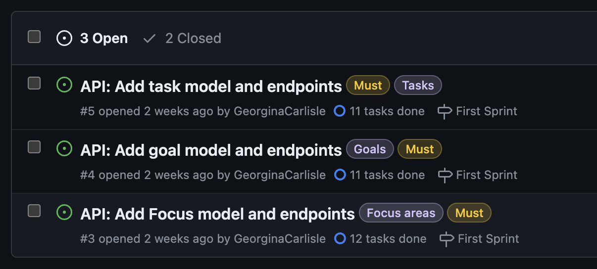
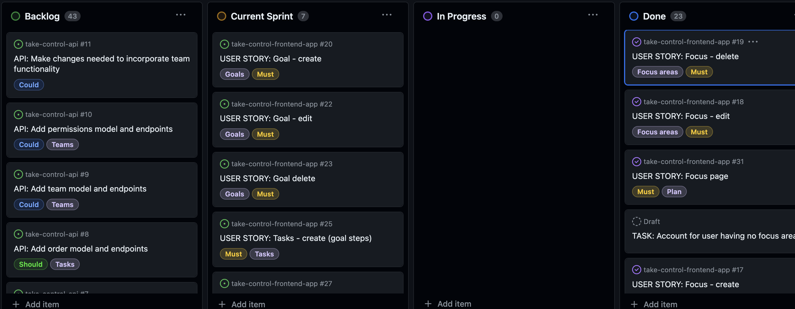

# Take Control

Developer: Georgina Carlisle

Image of application to go here

A task management application that allows users to set, manage and organise their focus areas, goals and tasks. Created using React alongside linked Django Rest API.

Links:

[Take Control App live](https://take-control-frontend-32659c908a57.herokuapp.com/)

[Take Control API live](https://take-control-api-d106d6135431.herokuapp.com/)

[Take Control API repository](https://github.com/GeorginaCarlisle/take-control-api)

## Contents

[Features](#features)

- [Existing Features](#existing-features)

- [Future Features](#future-features)

[Design](#design)

- [The Strategy Plane](#the-strategy-plane)

- [The Scope Plane](#the-scope-plane)

- [The Structure Plane](#the-structure-plane)

- [The Skeleton Plane](#the-skeleton-plane)

- [The Surface Plane](#the-surface-plane)

[Agile Methodology](#agile-methodology)

[Languages](#languages)

[Frameworks and Libraries](#frameworks-and-libraries)

[Tools and Technologies](#tools-and-technologies)

[Testing and Validation](#testing-and-validation)

[Bugs and Fixes](#bugs-and-fixes)

[Deployment](#deployment)

[Cloning this repository](#cloning-this-repository)

[Forking a branch](#forking-a-branch)

[Connecting to the Take Control API](#connecting-to-the-take-control-api)

[Credits](#credits)

[Acknowledgements](#acknowledgements)

---

## Features

### Existing Features

#### Navigation

A header with navigation links is present at the top of all pages, providing easy navigation between different sections of the application. It is fixed in position at the top of the screen, so that it is always accessible. Moving between sections is handled by routing, preventing the page from needing to re-load and making for a more seamless user experience. The navigation links provided are specific to whether the user is logged in or logged out. This ensures they are never provided with links that are unaccessible to them and also that they have the links they need.

On mobile, the navigation links are held in a dropdown menu. This allows for optimal use of the available screen size when on mobile. The menu is accessed by clicking on a hamburger icon, this is the expected behaviour for such an icon. Re-clicking the hamburger icon, choosing a link or clicking outside of the menu will close it.

The header contains the site title and logo in the top left. This makes it clear to the user that they are on the "Take Control" site. The logo and title also act as a link back to the home page, an expected behaviour.

Hovering over navigation links leads to a change in color to purple, this is a behaviour that is standarized across the site for interactive elements aiding in intuitive navigation.

In addition where the user is viewing a sub-page, such as when creating a new focus within the plan section, a back x is present in the top left of the features container. Clicking on the x will close the sub-page and return the user to their previous view, this is the expected behaviour for such an icon. The same hover functionality exists for this icon as the navigation links and an aria-label has also been attached to ensure clear understanding of the icon's purpose.

Further navigation through the site is provided by buttons. These buttons are all styled alike, with the same hover functionality. Clear names have been given to all buttons to aid with intuitive navigation.

When in the 'Take Action' page a method of navigating back into the plan is provided by clicking on the image next to a task. This will take the user back to the focus area for this task, or miscellaneous area if a miscellaneous task.

#### Authentication

Each users' data is private and protected, with authentication ensuring that no-one but the owner of the data can access it.

New users wishing to use the application's functionality will need to sign up in order for data to be saved with them as the owner. Links to the sign-up page are placed clearly within the main navigation bar, as well as through a call to action button on the site's landing page.

The 'Sign Up' page has a clear title and all input fields also have clear labels and placeholder text, thus making the form clear and easy to fill in. Should any fields be incorrectly completed, error messages are clearly displayed to the user. On successful completion of the form the user is re-directed to the 'Sign In' page where a success message is displayed.

In order to access their data a user will need to sign in. A clear link to the "Sign In" page is present within the main navigation.

The 'Sign In' page has a clear title and all input fields also have clear labels and placeholder text, thus making the form clear and easy to fill in. Should any fields be incorrectly completed, error messages are clearly displayed to the user. On successful completion of the form the user is re-directed to the home page, which alongside the header is now rendered specifically for authenticated users. A success message is displayed and the user is welcomed to their account.

JSON web tokens are used in the authentication process, with logic in place to ensure users are not unexpectedly logged out. When users are ready, in order to protect their data, they can logout. A clear link to 'Signout' is provided in the main navigation. On clicking to signout users are re-directed to the home page, which alongside the header is now rendered specifically for non-authenticated users. A success message is displayed to confirm that they are now signed out.

#### Plan

This area of the application is specifically designed for planning. It is an area that each user can mould to their own needs through how much of the available functionality they choose to use.

Users can define what is important to them, the areas in their life they wish to use this app to help with orginaising and moving forward in, by creating focus areas.

Within these focus areas they can create specific goals, adding the tasks needed to be completed in order to achieve the goal. Or they can simply add tasks specific to this area without any goals.

The miscellaneous section provides an area where users can any tasks that don't relate to the focus areas they have created.

The plan page can be accessed directly from the main navigation menu as well as from a call to action button displayed when users first log in to their account.

New users without any data will be presented with an explanation of the focus areas (this will disappear once they have a focus area) alongside the miscellaneous section. On mobiles this data is held within an accordion so that the user can quickly see everything before then choosing what they want to go into. On larger screens the different areas are shown in card form. A clear button to "Create a new focus area" is displayed at the top, so that this functionality is quick to access and isn't missed.

Each card, or accordion section will display the focus area alongside image (A default image is provided if not given) and focus why (if given). Underneath the goals within that focus area will be listed in deadline order. The goals will be listed with their deadline and description, should they have these, and also if the deadline is near a warning message to highlight this.

At the bottom of each focus area is a clear link to take the user in to that focus area. The miscellaneous area also has a link.

Clicking on these links will open up the focus area, or miscellaneous area.

#### Focus Areas

Authenticated users can create focus areas, so that they can define the areas of their life they wish to focus on. These focus will then contain goals and tasks, and provide a way to organise and easily identify the underlying purpose behind a task.

A button to create a new focus is clearly visible at the top of the plan page. This takes users to a form where they can create a focus area giving it an image and defining the reason why this area is important to them. The image and why are optional, and if no image is added the shown default image is used. Should any fields be incorrectly completed, error messages are clearly displayed to the user. Successful completion directs the user into the view area for this focus, where the user can start to add goals and tasks.

#### Focus view

Once a focus area is created users are directed straight to their focus area. At other times focus areas can be navigated to through the plan page.

Initially the focus area will be empty with placeholder messaging to support new users in using this area.

On mobile the different areas are within different sections on an accordion, with each goal created having it's own section.

On larger screens the page is split into different areas. Details about the focus are displayed at the top. Day to day tasks on the right and a list of goals on the left. Clicking on a goal opens it up into the central space.

Users can return to the plan page by clicking on the x in the top right.

#### Editing and deletion of focus areas

When viewing a focus area an edit icon is clearly visible. Clicking on this icon brings up the focus details in a form, where the user can then edit any of the details.

When viewing a focus area a delete icon is clearly visible. Clicking on this icon brings up a confirmation message message explaining what will happen on delete. Users can then choose to cancel or to delete. This ensures users don't accidentally delete anything they wish to keep. On successful delete users are return to the plan page and a success message is displayed.

#### Goals

Within their focus areas authenticated users can create goals, giving themselves direction and something to aim for as they move forwards. All that is needed to create a goal is a goal name. However, there are a numer of optional input fields that can be used to make goals specific, measurable, achievable, reachable and time-bound as well as a field to  define the value to be gained in achieving the goal.

On mobiles there is a section within each focus areas' accordion for creating a new goal. Clicking on the tab will open up the form. On larger screens a button to create a new goal is clearly visible at the bottom of the goal list within each focus area. Clicking this will open up a form within the central space.

Should any fields be incorrectly completed, error messages are clearly displayed to the user. Successful completion on mobile clears the form, a success message is displayed and a extra tab containing the new goal is added to the accordion. Successful completion on larger screens changes the central space to show the new goal, a success message is displayed and a tab containing the goal's name is added to the goal list.

When viewing a goal an edit icon is clearly visible. Clicking on this icon brings up the goal details in a form, where the user can then edit any of the details.

When viewing a goal a delete icon is clearly visible. Clicking on this icon brings up a confirmation message message explaining what will happen on delete. Users can then choose to cancel or to delete. This ensures users don't accidentally delete anything they wish to keep. On successful delete the goal is removed from the focus area and a success message is displayed.

#### Tasks

Authenticated users can create tasks to list all the things they need and want to do. These tasks can be organised through focus areas and goals. When planning users can create:

Miscellaneous tasks - Tasks not attached to any focus areas.

Day to day tasks - Tasks linked to a focus area, but not part of a specific goal.

Goal tasks - Tasks specifically linked to goal. The steps needed to be taken to achieve that goal.

Tasks can also be created directly from the 'Take Action' page, where there is a clear button at the top to "Add additional task". The form to create a new task here has extra fields that allow the user to choose whether to link the task to a focus area and then to a goal should they wish. This allows users to quickly add extra tasks without needing to navigate away from the "Take Action" page.

When viewing a task in while in a focus or the miscellaneous area, three dots are clearly visible to the left. Clicking on the dots brings up a choice to edit or delete. Clicking to edit brings up the task details in a form, where the user can then edit any of the details.

When viewing a task in while in a focus or the miscellaneous area, three dots are clearly visible to the left. Clicking on the dots brings up a choice to edit or delete. Clicking to delete brings up a confirmation message message explaining what will happen on delete. Users can then choose to cancel or to delete. This ensures users don't accidentally delete anything they wish to keep. On successful delete the task is removed from the list of tasks and a success message is displayed.

#### Miscellaneous area

For tasks a user wishes to record that don't fall into one of their focus areas, a miscellaneous area has been provided. The miscellaneous area can be accessed drirectly from the plan page.

Miscellanous tasks are listed in order of deadline, with a form to add further tasks at the bottom.

#### Success messages

Every time a user successfully makes a change to their data - creation, editing or deletion - a success message is given. Every success message contains a title and details about the change that has been made. This success message is displayed at the top right of the screen just under the header, so as to always be visible but out of the way so it doesn't interrupt the user. The success messages can be dismissed by clicking the x, or will disappear on there own after 8 seconds. This provides time for the user to see and read the message, while allowing the user to continue with what they are doing without having to stop a close a message everytime they make a change to the data.

#### Take Action

Once a user has made their plan, the "Take Action" section is where they can select tasks they want to work on today and start ticking them off. It can be accessed directly from the main navigation menu as well as from a call to action button displayed when users first log in to their account.

The Take Action is made of three sections, displayed in an accordion on mobiles and alongside each other on larger screens. On tablets these sections will need to be scrolled across, as it was decided that this was a better option that squeezing up the data, still utilizing an accordion at this screen width or using an alternative structure. When there is no data present placeholder text has been used.

An "End of day reset" button is provided at the top of the page. Clicking on this brings up a confirmation message which explains this process. On confirmation, any completed tasks are deleted and all today tasks are moved back into the backlog. This provides a quick way of clearing the "Take Action" page ready for a new day.

A button to "Add additional task" is also provided at the top of the page. Clicking on this brings up a form to create a new task with extra fields provided that allow the user to choose whether to link the task to a focus area and then to a goal should they wish. This allows users to quickly add extra tasks without needing to navigate away from the "Take Action" page.

#### Backlog column

All a users tasks can be viewed in the backlog, allowing them to see all their tasks together. Tasks are initially ordered by task deadline and then by the order the tasks were created in, with task first created first.

Tasks are displayed with an image indicating the focus area they belong to, this makes it visually clear which area a task belongs to. Underneath the task name extra information is then displayed:

- The context of the task, is it a step towards a specific goal, a day to day task for a focus area or a miscellaneous task
- The deadline (if there is one) for the task is displayed, which will include a warning if the deadline is near.
- The deadline for the linked goal (if there is one), which will include a warning if the deadline is near.

Users can adjust the order the tasks are displayed in, by using the order by options found at the top of the backlog list. The following options are provided:

- Task Deadline (this is the default) with soonest deadline first and tasks without deadline then ordered by when they were created, oldest first.
- Focus Area where the focus areas are ordered by when they were created, oldest first.
- Goal with goals with the soonest deadline first
- Most recent task.

Users can also specifically search for taks, by using the search input box found at the top of the backlog list. On entering a key word, all tasks whose name, or the name of it's linked goal or linked focus area will be returned.

#### Today column

Tasks checked as today in the backlog will appear in the today column. Unchecking today in the backlog will remove the task from today. All tasks in the today column are displayed with a done checkbox.

#### Completed column

Tasks checked as done in the today column are removed from today and added to completed. Here they are displayed with done checked to on. Users can unchecked done to remove the task from completed and return it to today.

All tasks set as done have their names highlighted in green (both in the completed column and in the backlog column) and in the backlog column are also given a done status which appears under the today checkbox.

### Future Features

#### Editing and deletion of user profile

At the moment there is no functionality present to allow the user to edit their username, email address or password. Nor is there a way for them to delete their account. This functionality will be a priority for the next iteration of this project. For this first iteration the priority was in making sure that the application itself was fully functioning in order to showcase what this project is about.

See user stories 12, 15 and 16 within the [scope plane of design](#the-scope-plane).

#### Ranking focus areas

In future there will be an option to rank focus areas, with the ordering of backlog tasks by focus showing the highest ranked focus area first. This will provide another way for users to be able to prioritise which tasks to work on first.

See user story 42 - Rank focus areas within the [scope plane of design](#the-scope-plane) and the wireframes for the ordering page within the [skeleton plane of design](#the-skeleton-plane).

#### Nested goals

The api used by this application already has functionality built in that allows users to choose to nest children goals inside a parent goal. This allows large goals to be broken up into smaller more easily achieveable chunks. In future this functionality will be brought into the frontend application.

See user story 21 - Nested goals within the [scope plane of design](#the-scope-plane) and the wireframes for the focus page within the [skeleton plane of design](#the-skeleton-plane).

#### Activate and pause goals

In future there will also be the option to pause and then re-activate goals. This active status will be passed on to tasks nested within the goal, with only active tasks being displayed within 'Take Action'. This will provide a way of narrowing focus when needed and controlling which tasks are displayed in the backlog ready to be completed.

See user story 39 - Activate and pause goals within the [scope plane of design](#the-scope-plane).

#### Repeated tasks

In future extra fields will be available when creating a task. These will allow users to specify tasks to be repeated, including details on frequency. The daily reset functionality will be adjusted so that any completed repeated tasks are not deleted but simply returned to the backlog. Additional data will also be generated so that users are kept informed of how many times they have completed the task that week.

See user story 29 - Repeated tasks within the [scope plane of design](#the-scope-plane) and the wireframes for the focus page and new task page within the [skeleton plane of design](#the-skeleton-plane).

[Return to contents list](#contents)

#### Ordering today tasks

In future there will be an option to order tasks within the today column, providing further functionailty to help users prioritise their tasks.

See user story 44 - Order today tasks within the [scope plane of design](#the-scope-plane) and the wireframes for the ordering page within the [skeleton plane of design](#the-skeleton-plane).

## Design

### The Strategy Plane

#### Target User Group

Adults who are wanting to take control and push forwards in their life. Setting goals, making progress and keeping on top of everything they wish to achieve.
The target group often have lots on their plate and want to be able to keep multiple plates spinning.

#### Problem Background

For those with a full life, lots on their plate and lots they want to achieve, it can be hard to keep track of everything and despite determination and hard work things start to slip and get missed. It can be difficult to prioritise and manage everything in a way that allows for balance and progression across multiple areas. Without a way to keep organised their focus can jump from area to area, with long-term consistency difficult to maintain and any progression made easily lost.

#### Problem Statement

“I am a busy individual who is finding it difficult to keep track of everything I need to do and all the extra things that will enable me to progress and push forwards.”

#### Project Aim

To provide users with an application that allows them to store and manipulate data that:

- identifies the different focus areas in their life
- sets goals
- notes tasks to be undertaken (one off and repeated)
- allows for organisation and prioritisation
- allows for tracking and deadline setting

#### Safety Considerations

User’s data needs to be kept safe. Viewable and editable by them alone. The code behind the application also needs to be kept safe with secret keys etc. hidden.

[Return to contents list](#contents)

### The Scope Plane

This project will provide a secure front-end application which will allow users to easily create and interact with their data (see user stories below). Data will be stored securely in a backend database, controlled and served by an API.

[Link to Take Control API](https://github.com/GeorginaCarlisle/take-control-api)

User Stories which detail the scope of this project from the users point of view have been organised by epic.

#### Epic - New User Experience

1 - As a new user, I can instantly see information about the application, so that I can understand the value that it may offer me.

2 - As a new user, I can find out more about the planning side of the application, so that I can learn more about how the application works enticing me to sign up.

3 - As a new user, I can find out more about the take action side of the application, so that I can learn more about how the application works enticing me to sign up.

#### Epic - Navigation

4 - As a user, a clear navigation bar is present throughout the site, so that I can navigate easily between different sections of the application.

5 - As a user, the navigation bar contains links which are specific to whether I am logged in or logged out, so that all available links are relevant and accessible to me.

6 - As a user, navigation between different sections of the website is seamless without un-necessary page refreshing, so that I can navigate quickly around the site.

7 - As an authorised user, all sub pages include an x that will return me to my previous page on clicking, so that I can easily check things out and then return to where I was.

8 - As an authorised user, clicking on a task within the ‘take action’ page will take me to the ‘plan’ page where that task is located.

#### Epic - Authentication

9 - As a new user, I can easily set up an account, so that I can quickly get stuck into exploring and using the application.

10 - As a signed-up user, I can use my username and password to sign in to my account, so that my account remains secure and only I can login.

11 - As a signed-up user, I am the only one who can access my data, so that it remains safe and secure.

12 - As a signed-up user, I can reset my password, so that I can still access my account even if I have forgotten my password.

13 - As an authenticated user, I can easily logout of my account, so that I can keep my account secure.

14 - As an authenticated user, I can maintain my authenticated status until I choose to log out, so that I am not unexpectedly logged out due to expired access tokens.

15 - As an authenticated user, I can edit my user information, so that I can make changes to my username and password, helping me to keep my account secure.

16 - As an authenticated user, I can delete my data including my user data, so that I can remove all my data from the system should I wish to.

#### EPIC - Focus areas

17 - As an authenticated user, I can create focus areas, so that I can set out the different areas in my life that I want to use this app to support with and why each area is important to me.

18 - As an authenticated user, I can edit a focus area, so that I can make changes should I wish.

19 - As an authenticated user, I can delete a focus area, so that I can remove information I no longer need or want.

#### EPIC - Goals

20 - As an authenticated user, I can create goals that are linked to a focus area, so that I can set myself progression targets that are specific, measurable, achievable, reachable and time-bound, defining the value to be gained in achieving the goal.

21 - As an authenticated user, I can create goals within goals, so that I can break up large goals into more achievable chunks.

22 - As an authenticated user, I can edit a goal so that I can make changes should I wish.

23 - As an authenticated user, I can delete a goal, so that I can remove information I no longer need or want.

#### EPIC - Tasks

24 - As an authenticated user, I can create tasks linked directly to a focus area, so that I can set out day to day tasks associated with that area.

25 - As an authenticated user, I can create tasks linked to a goal, so that I can set out the steps I will need to take to achieve my goal.

26 - As an authenticated user, I can create unlinked tasks, so that I can include any tasks not directly linked to a set focus area or goal.

27 - As an authenticated user, I can edit a task, so that I can make changes should I wish.

28 - As an authenticated user, I can delete a task, so that I can remove information I no longer need or want.

29 - As an authenticated user, I can set tasks to be repeated, so that I can easily include habitual tasks.

#### EPIC - Plan

30 - As an authenticated user, I can view all my focus areas and their nested goals together on one page, so that I can see and manage the bigger picture of everything I have going on.

31 - As an authenticated user, I can view all the goals and tasks within a given focus area together, helping me to plan how I wish to move forwards in this area and everything that is need to achieve that progression.

32 - As an authenticated user, I can view all my miscellaneous tasks together in one place, so that I can plan tasks that don't link to any of my focus areas.

#### EPIC - Informed User

33 - As an authenticated user, I receive a success message on creation, editing and deleting, so that I know my action was successful.

34 - As an authenticated user, I receive a confirmation message on clicking to delete, so that I am made aware of any linked information that will also be deleted should I proceed and can avoid any accidental deletes.

35 - As an authenticated user, I receive a confirmation message when an action will result in form input updates remaining unsaved, so that I don’t accidentally lose data I meant to save.

#### EPIC - Take Action

36 - As an authenticated user, I can view all active tasks together in a take action page, so that I can plan and organise my day.

37 - I can click to reset the Action page, deleting one-off completed tasks and returning everything else to the backlog, so that I can start afresh each day.

#### EPIC - Backlog

38 - As an authenticated user, I can view all my pending tasks within a backlog list, so that I can easily see everything to be done altogether.

39 - As an authenticated user, I can activate and pause goals, so that only tasks from goals I actively want to work on are added to the backlog.

40 - As an authenticated user, I can order tasks in the backlog by repeated, focus, deadline, most recent, least recent, day to day or goal, so that I can set up the backlog in a way that works for me.

41 - As an authenticated user, I can quickly add new tasks to the backlog without needing to go through the planning page, so that I can quickly and easily add additional tasks.

42 - As an authenticated user, I can rank my focus areas by importance, so that goals and tasks associated with this area will appear at the top of the backlog.

#### EPIC - Today

43 - As an authenticated user, I can toggle tasks to work on today moving them into a today list, so that I can prioritise and organise what I want to achieve today.

44 - As an authenticated user, I can order tasks in today, so that tasks are displayed in the order I intend to work through them.

#### EPIC - Completed

45 - As an authenticated user, I can toggle tasks as completed moving them to a completed list, so that I can see exactly what I have achieved.

#### EPIC - Labels

46 - As an authenticated user, I can create custom labels, so that I can categorise my tasks.

47 - As an authenticated user, I can edit custom labels, so that I can make changes should I wish.

48 - As an authenticated user, I can delete custom labels, so that I can remove any unneeded labels helping me to maintain an uncluttered system.

49 - As an authenticated user, I can add custom labels to my tasks, so that I can set up my own system to aid with prioritisation.

#### Epic - Tracking

50 - As an authenticated user, where I have set a deadline, the app calculates how long I have left in easy terms (weeks initially and then days), so that I can make sure I meet my deadlines.

51 - As an authenticated user, when my deadlines are near the associated tasks are highlighted, so that my attention is drawn to tasks that I need to prioritise in order to meet my deadlines.

52 - As an authenticated user, where I have repeated tasks, the app keeps track of how many I have completed for the set time period, so that I know whether the task is due or not.

53 - As an authenticated user, repeated tasks that need to be completed today in order to achieve the set frequency are highlighted, so that my attention is drawn to the task helping me to keep on top of repeat jobs or habits I am trying to form.

54 - As an authenticated user, tasks that have been awaiting completion for a long time are highlighted, so that my attention is drawn to them helping me to weed out tasks as well as not leaving important things undone.

55 - As an authenticated user, goals that haven’t had any tasks or tasks of nested goals completed are highlighted, so that my attention is drawn to them helping me to weed out goals that are no longer important as well as not leaving important goals undone.

#### Epic - Teams

56 - As an authenticated user, I can set up a team of other users who I would like to grant access to my data, so that I can use the app for shared goals and tasks.

57 - As an authenticated user, I can grant write access to all goals and tasks nested within a focus area to members of my team, so that they can contribute to the organisation and management of goals and tasks within this focus.

58 - As an authenticated user, I am grant read access to all goals and tasks nested within a focus area to members of my team, so that they can see what I am working on.

[Return to contents list](#contents)

### The Structure Plane

The following diagram shows the main features within the application and the user's path through these.

A [Component Plan](documentation/planning/component-plan.pdf) has been created showing how React components will be used to achieve this structure. This plan is designed as a starting point that will be further adapted as the project is being built and also contains notes on some of the key functionality.

For backend structure please see the [Take Control API README](https://github.com/GeorginaCarlisle/take-control-api?tab=readme-ov-file#design).

[Return to contents list](#contents)

### The Skeleton Plane

A number of wireframes have been created to plan out how and where everything will be displayed. The final layout will be further developed during the build phase. Any changes will be noted in the [features](#features) section.

#### Landing Page

#### Main plan page

This is where users will first be taken when they log in.

Differences between planning and live project:

- The functionality to activate and pause goals will be implemented in future.

#### Focus page

The focus page is accessed through the plan page and includes a number of components, all of which can be rendered in create, view, or edit modes. Three wireframes have been included to show these different variations.

Differences between planning and live project:

- To allow the main focus page to be accessed by routing with a url including the focus.id number, creation of a new focus was given it's own page. On successful creation of a new focus the user is then redirect to the focus page for the focus they have just created.
- The nested goal functionality will be implemented as a future feature.
- The additional fields and information related to setting tasks as repeated will be implemented as a future feature.

#### Miscellaneous page

This is page for unlinked tasks and is accessed from the main plan page. It will also handle editing in the same manner as the focus page.

Differences between planning and live project:

- The additional fields and information related to setting tasks as repeated will be implemented as a future feature.

#### Take Action page

Differences between planning and live project:

- The additional fields and information related to setting tasks as repeated will be implemented as a future feature.
- A search feature has been added for the backlog column, enabling users to quickly find relevant tasks.
- Ordering of today tasks will be implemented as a future feature.
- The 'End of day reset' and 'Add task' buttons have been moved to just under the title on mobile. This ensures these buttons are not missed.

#### Labels page

Once labels have been created, they can be added in the Take Action page.

#### Ordering page

This wireframe shows today's tasks being ordered. The same setup will also be used for ranking focus areas.

Differences between planning and live project:

- The ability to order focus areas and today tasks will be implemented as a future feature.

#### New task page

The new task page provides a quick way of creating new tasks that is accessed directly from the take action page.

[Return to contents list](#contents)

### The Surface Plane

#### Aims

The aim for the surface plane is to provide a clean, relaxed and professional space.

There will often be a lot on the screen, the vast majority of which will be text and so white space, clearly defined containers and use of colour will be key to helping the user navigate around the information.

The application contains a lot of interaction through which the user will manipulate their data. Common icons will be used helping to maintain a clean and uncluttered site. Only well-known icons will be used, aiding intuitive navigation of the site, aria-labels and hover labels will also be added to make these accessible to all. Where buttons are used, they will follow consistent styling.

The application needs to provide a great user experience on both mobile and desktop, so that it can be used will the user is working on a desktop as well as throughout the day via mobile.

#### Accessibility

The following will be utilised to increase the accessibility of this application:

- Semantic html to pass on clear meaning at a base level.
- High text colour contrast throughout. With all text passing both WCAG AA and WCAG AAA for their text size.
- Aria labels, alt text and aria-hidden to ensure visual information will be correctly passed on for those who cannot access it.
- Space around clickable elements on mobile, so that it is easy for users to activate the correct functionality when using a touch screen.

#### Frameworks and libraries to support styling

[React bootstrap](https://react-bootstrap-v4.netlify.app/) will be used to speed up styling and allow time to be focused on functionality. Bootstrap’s grid system will be used to control responsivity. The following components from bootstrap will also be used and modified as needed:

- Alerts (for success and error messages)
- Accordion (for mobile views)
- Badges (for labels)
- Buttons (for form submission etc.)
- Cards (for focus cards)
- Dropdowns (for mobile nav and task choices)
- Forms (for create and edit functionality)
- List Group (throughout)
- NavBar and Nav (for main navigation)
- Overlay/Popovers/tooltips (for hover info on functional items)
- Spinners (for indicating data loading)

[React drop and drag](https://react-dnd.github.io/react-dnd/about) will be considered for improving user experience by allowing users to drag tasks from backlog to today and then from today to completed, rather than a more clunky toggle system. It will also then be used for ordering of today tasks and ranking focuses. As this will involve upskilling, it will only be used should time allow.

#### Colour Scheme

The following colours have been chosen:

The main sections of the page will be given different background colours to help differentiate them as different:

- Header (light grey)
- Main background (Green – with low opacity)
- Page component (very light grey)
- Footer (dark grey with white text)
- Alert messages (light blue)

The main text will be black with colour being used for the following to aid navigation and page scanning:

- Logo + section titles (Green)
- Page title and current page in nav bar (Purple)
- Clickable elements (Pink)
- Clickable elements on hover (Purple)

Please see [TESTING.md](TESTING.md) for contrast level tests.

#### Font choices

For the application name and page titles [Bebas Neue by Ryoichi Tsunekawa](https://fonts.google.com/specimen/Bebas+Neue?preview.text=Take%20Control&classification=Display&stroke=Sans+Serif) has been chosen as it gives a real feeling of strength and taking control.

For the main text [Lato by Lukasz Dziedzic](https://fonts.google.com/specimen/Lato?query=Lato) has been chosen as it has a very clean and relaxed feel to it fitting in with the aims for the surface plane. It also has a number of styles within it providing scope to change the weight of the font etc.

#### Logo

A logo image has been created, incorporating the main green colour and the idea of a spinning plate made up of different elements. This logo will sit alongside the app name “Take Control” and slogan “Keep all your plates spinning” and will be used as the favicon.

[Return to contents list](#contents)

## Agile Methodology

Agile values and principles have been followed in the creation of this project where they fit into a solo project built purely for educational purposes within a very short timescale.

In particular the following common Agile practices have been followed: user stories, product backlog, time boxing, prioritization and information radiators.

### User Stories

Please see the [Scope Plane](#the-scope-plane) for the user stories created for this project which breakdown the Epics detailing the main features of the platform into manageable chunks of work.

The issues tool on GitHub has been used to record all user stories. Acceptance criteria and tasks were added to the user stories as the project progressed.

### MoSCoW Prioritisation

Due to the short time frame in which to build this project all user stories were given a MoSCoW label at the very beginning of the development phase:

Must-have - the user stories deemed vital for this phase of the project.

Should-have - the user stories deemed important but not vital for this phase of the project.

Could-have - the user stories that will only have a small impact if left out of this phase of the project.

Throughout the development phase I worked on completing all must-haves before assessing to see if I had time for should-haves and could-haves. As I progressed through the time available for completion of this project, I then began to re-categorised some of the user stories into:

Won't-have - the user stories that won't be worked on during this phase of the project, forming future features for the project.

### Information Radiator

GitHub projects was utilised as a kanban board for this project and was linked to both this repository and the [Take Control API repository](https://github.com/GeorginaCarlisle/take-control-api). This allowed both frontend and backend tasks to be viewed together and worked on in an order that allowed me to push for the best overall product that could be achieved within the time frame.

### Product Backlog

A product backlog was used in which to store all user stories, prior to being assigned into an iteration. Any user stories not completed at the end of the iteration were then moved back into the backlog. At the end of the project a number of user stories remained in the product backlog. These have been discussed in the [future features](#future-features) section of the readme.

The product backlog is visible on GitHub through the use of a specific backlog column in the project board.

### Time Boxing

Developement of the project was split into four time boxes/iterations. Each iteration was set to a period of one week and had a set focus. This allowed for judgements to be made for each task as to how far to push perfection and how quickly to move on, so that I was able to bring the project together into a finished state prior to the deadline.

#### First Sprint

Focus: Getting everything set up and initial deployment of both repositories before beginning API must-haves.

Beginning of the sprint:

End of the sprint:

Notes: I was able to push on further than first anticipated and added further user stories into this sprint.

Finished tasks for the API:

Open tasks for the API:

Note: The above tasks have been completed, however as there have been issues manually testing PUT, PATCH and DELETE endpoints they remain open until these have been fully tested via the frontend. See [manual testing information](https://github.com/GeorginaCarlisle/take-control-api/blob/main/TESTING.md#manual-testing) for more details.

Finished tasks for the frontend:

Open tasks for the frontend:

Note: The Landing Page user story is completed for this stage of the project and will be further enhance at the end. The sign-up and sign-in pages just need to generate a success message in order to be completed.

#### Second Sprint

Focus: Working through the must-haves for the frontend and checking that all api endpoints are working correctly when accessed via the frontend.

Beginning of the sprint:

End of the sprint:

Notes: This sprint was full of both [frontend](#bugs-and-fixes) and [backend bugs](https://github.com/GeorginaCarlisle/take-control-api?tab=readme-ov-file#bugs-and-fixes), which significantly slowed down progress and as a result a number of users stories remain untackled.

Finished tasks for the frontend:

Open tasks for the frontend:

Note: No api tasks were part of this sprint.

#### Third Sprint

Focus: All must-haves to be completed. A decision to then be taken on what else can be achieved in the remainder of this sprint.

Beginning of the sprint:

End of the sprint:

Finished tasks for the frontend (no open issues remained for this sprint):

As good progress was made during this sprint extra issues were added and closed during the sprint:

Note: This sprint was closed slightly ahead of schedule with a decision to push straight on into sprint four and final testing and validation before re-assessing time remaining as to whether any further user stories should be worked on.

#### Fourth Sprint

Focus: Final testing and README tasks alongside ensuring any remaining bugs are fixed.

Beginning of the sprint:

[Return to contents list](#contents)

## Languages

HTML, CSS, JavaScript and JSX

[Return to contents list](#contents)

## Frameworks and Libraries

[React 17.0.2](https://legacy.reactjs.org/docs/getting-started.html) - A JavaScript library for building user interfaces. An older version was chosen to stay inline with all other dependencies used as part of the Moments walkthrough which provided a base that this project was then modelled on.

[React bootstrap 1.6.3](https://react-bootstrap.github.io/) - A frontend framework built for react that provides common components. React bootstrap was chosen to help speed up the development of this project and allow time to focused elsewhere.

[React Router 5.3.0](https://github.com/remix-run/react-router) - A lightweight, fully-featured routing library for React.

[Axios](https://axios-http.com/) - A simple promise based HTTP client for the browser and node.js.

[jwt-decode 3.1.2](https://www.npmjs.com/package/jwt-decode) - Used to decode the JSON web tokens.

[react-infinite-scroll-component](https://www.npmjs.com/package/react-infinite-scroll-component) - Used to provide loading of next set of data on page scrolling where the data exceeds pagination limit.

[Return to contents list](#contents)

## Tools and Technologies

### Tools and technologies used to aid with planning

[Drawio](https://www.drawio.com/) - Used to create the flow diagram showing how the user will move through the website.

[Balsamiq](https://balsamiq.com/) - Used to create wireframes showing the skeleton plane of the design phase.

[Material - Palette configuration tool](https://m2.material.io/inline-tools/color/) - Used to generate colour scheme ideas.

[Adobe](https://color.adobe.com/create/color-wheel) - Used to create the colour scheme image.

### Tools and technologies used to aid with the coding of this project

[Code Institute Template](https://github.com/new?template_name=react-ci-template&template_owner=Code-Institute-Org) - Provided me with a familiar base from which to build my project.

[GitHub](https://github.com/)  - Stores the repository for this project so that it can be viewed by others. Github issues and projects were also utilised, see [Agile Methodology](#agile-methodology).

[git](https://git-scm.com/) - Controlled the building of this project in a series of versions which can be tracked.

[Visual Studio Code](https://code.visualstudio.com/) - The editor in which this project has been built.

[Chatgpt](https://chat.openai.com/) - Chatgpt was used on occasion to help troubleshoot bugs. It's use has been clearly referenced in [bugs and fixes](#bugs-and-fixes).

### Tools and technologies used to aid with the content for this project

[Smashing Logo](https://smashinglogo.com/en/) - Used to help generate ideas for the logo.

[Inkscape](https://inkscape.org/) - Used to create the logo following an idea generated within Smashing Logo.

[Favicon.io](https://favicon.io/favicon-converter/) - Used to convert the logo into a favicon.

[Photoscape X](http://x.photoscape.org/) - Used to re-size and crop images.

### Tools and technologies used to aid testing this project

[WebAim contrast checker](https://webaim.org/resources/contrastchecker/) - Used to test the contrast between foreground and background colours to ensure they met accessibility guidelines.

[Return to contents list](#contents)

## Testing and Validation

See [TESTING.md](TESTING.md) for all testing and validation.

## Bugs and Fixes

| # | Bug | What was tried | Fix |
| --- | --- | --- | --- |
| 1 | Redirect to signin was being called, even when their was a current user, on refreshing the page. | Tested and confirmed navigation links handling as expected. Checked through code. Used console.log to check currentUser contained a user. Troubleshooted issue with chatGPT. | The CurrentUserContext initially set currentUser to null, with [chatGPT](https://chat.openai.com/) suggesting "This might lead to a flicker or delay in rendering the protected routes while currentUser is being fetched." Following the suggestion to set currentUser to an empty object instead resolved the issue. |
| 2 | Dangerous site warning on first accessing the deployed url. | Slack searched for similar issues faced by other students. | Warning is due to the frontend and backend coming from a different point of origin and the cross site refering involved. If time allows I will look into combining front and backends under one terminal. |
| 3 | When calling the base root users are automatically redirected to the signin page, instead of being able to view the home page. | Tested accessing the home page through the logo link, this worked as expected. Used chrome dev tools to step through the code on initial loading of page. Very early on CurrentUserProvider is run and get request made and currentUser is set to an empty array. Home is then initially rendering as though there is a user. However, a few steps further on the axiosRes interceptor is run which fails as there is no token and consequently it pushes the signin route as there was a user. Adding console.logs confirmed that currentuser is initially being classed as True. CurrentUser initially {} due to code in CurrentUserContext. | Changing initial setting of currentUser from {} to null within CurrentUserContext.js. |
| 4 | The back button in mobilefocus is not working (no hover, no pointer and no functionality) when editing the focus. It works in all other scenarios where this button is found. | Explored the css using chrome dev tools and noticed a message saying [type=button]:not(:disabled). Explored further and noticed that the edit form element overlaps the button. | Adjusted styling so that there was no overlap, button now working. |
| 5 | Installing and attempting to use date-picker led to the following error: "./node_modules/date-fns/startOfISOWeek.mjs Can't import the named export 'startOfWeek' from non EcmaScript module (only default export is available)" | Research at [stackoverflow](https://stackoverflow.com/questions/69343038/cant-import-the-named-export-xxxx-from-non-ecmascript-module-only-default-expo) led me to believe that a webpack.config.js was needed to resolve the error. I then went round the houses twice (once on my own and once with tutor support), creating my own webpack.config.js file and fighting through lots of file, dependency and installation issues finally resulting in needing to remove the webpack file as it was preventing npm start with no way around that we could find. Alternative options were sort. Tried [react-bootstrap-date-picker](https://www.npmjs.com/package/@types/react-bootstrap-date-picker) but this caused dependency issues with the react bootstrap already installed. Tried [react-day-picker](https://react-day-picker.js.org/) but this led to the issue as it also utilized date-fns. | Decision due to time restraints to call off the hunt for a date picker and instead fall back on a simple hmtl input field with type date, then exploring any conversion need to work with drf api. |
| 6 | New tasks not showing in the backlog | Checked that no reference to active was being made in post requests. Issue identified as being a backend issue. | As active field is not currently being used, get request for the backlog has been changed to pull all tasks. |
| 7 | Infinite scroll not handling as expected. More data called, but loader keeps loading | Reading through documentation I believe the error is due to the set up of the take action page and the fact that no page scrolling as such takes place as oall scrolling is handled in the window | Decision to increase page size on the backend to allow more data to come through. Other solutions will be looked into during the next iteration of the project. |
| 8 | Functionality to add an image to a focus (both on create and edit) no longer working. Nothing happens on clicking the choose file button. | No errors in the console that might indicate the issue. Compared code with walkthrough. Exploration of commit history for changes made to focus create and focus edit. Tried reverting the chages made in commit "0f457ef: Adjust the add image in focuscreate". Functionality still not working and so these changes ruled out as the issue. Google and slack searches returned no similar issues. Troubleshooting with chatgpt led to no leads. Request for help on slack made. | |
| 9 | When editing tasks or goals with no deadline the date input field is automatically set to 01/01/1970 | Walked through the code and no logic in place to counter for deadline being null leading to program attempting to convert null to a date. | Added additional logic to check for null deadline and return converted deadline as '' when this is the case. |
| 10 | When logged in and in a route restricted to authenticated users only, refreshing the page redirects the user to the signin page. | Troubleshooted issue with [chatGPT](https://chat.openai.com/). Suggestion that new route might be rendering while currentUser still being determined. I also found the following stackoverflow question: [I always get redirected to home page when refresh any page](https://stackoverflow.com/questions/75686960/i-always-get-redirected-to-home-page-when-refresh-any-page). I tried putting in logic to check currentUser has been determined before checking currentUser value, running into issues. I then switched to checking authenticated status based on the presence of tokens in local storage (no api call needed) making sure to check this with a useEffect that would then run prior to app.js rendering. Throughout I added console.logs to try and determine what was going on. At this point the logs seemed to suggest that useEffect code was being run prior to rendering, but that the new true value was not correctly being passed into the authenticated variable. I then stepped through the code using chrome dev tools debugger. It looked as though the route was determined, including redirect logic before the useeffect statement was properly run and so the redirect logic was based on the default state not the updated state. It also appeared that my useeffect was not correctly updating the state. However then the routes were then checked again at which point authenticatedUser can clearly be seen as true while currentUser is still null. I noticed though that the url /signin is already in the url bar. The routes seemed to being checked for a match for signin, which is then the route that is activated. In response I set a value to indicate tokensChecked and wrapped the switch is a ternary statement so that it is only run once tokensChecked has been updated to true. Stepping through the code again with the debugger shows again rendering taking place before useEffect is run, however this time the switch is prevented from running as tokensChecked is default false. Again it appears as though my useeffect is not correctly updating the state initially, however the state is correctly updated on the next pass through the code. Router matches the /plan route is being true, it then recoginises /signin as a child. It continues to check but appears to be holding /plan as the matched route throughout. It then starts to step through the plan code and at this point errors, due to needing the currentUser, which at this point is still set to null as it hasn't yet been fetched. Added in a new variable 'checkedUser', pulled from CurrentUserContext to add in a loading statement while checkedUser is false. Everything then worked!! | Redirect determined by the presence or absense of tokens in local storage. Switch prevented from running initially by a tokensChecked variable which is default false and updated to true once tokens have been checked. Components rendered by protected routes given extra logic to prevent any elements needing currentUser from rendering until checkedUser is true. |
| 11 | Accessibility errors in wave for taskcreate and goalcreate forms being displayed in the focus page: missing form labels and multiple form labels | Explored the code, and compared the forms displayed in focus with other forms that don't give errors. Changed deadline input to be wrapped in bootstrap form.group, with label and control. Troubleshooted the issue with chatgpt and questioned if the fact that multiple forms are being pulled into the same space might be leading to the issue. Ensured that all form groups have a unique id. Errors still present. Searched further and found: [React js error: A form label must be associated with a control](https://stackoverflow.com/questions/69190827/react-js-error-a-form-label-must-be-associated-with-a-control) which suggested nesting the input within the label. This did not work. I looked directly at the generated code provided in wave, but this gave no hints as to why it was giving errors. I specifically explored how the taskcreate renders in miscellanous without error but not when in a focusarea. Running generated html for all taskcrate and goalcreate forms in all locations where they are rendered through a diff checker showed no differences on current deployed and a difference in ids (representing where the form is) on local. Pushed changes want to keep to git hub. Assistance sort from tutor support. Suggestion that it might be a bug generated within wave itself and not due to my code, as inputs and labels are clearly linked. Testing through lighthouse showed no errors related to the form. | Identified as probably just a bug originating within wave it's self, with my code clearly linking label and input. Please see [accessibility section](https://github.com/GeorginaCarlisle/take-control-frontend-app/blob/main/TESTING.md#accessibility-testing) in testing for screenshots of errors and generated code. |
| 12 | When adding a deadline, I noticed the date being saved was not the same as the date being inputted | I tested a few different scenarios and used console logs to see the date being pulled from the form, what it was converted to and the date coming back with the data following the post request. This showed the data being correctly converted upto and including 30th March, where timezone is given as Greenwich Mean Time GMT+0000. However from the 1st April onwards, where the timezone is given as British Summer Time GMT+0100 the date is coverted to the day before the given date. The console logs also show that prior to converting the time given to the inputted date (which is originally just day, month, year) is midnight. The addition of the time is necessary to enable conversion. This indicates that the issue is probably arising from the lost hour pushing the datetime backwards into the day before. I then also explored what was happening during the conversion of incoming deadline data into the edit form date input field. Again, on conversion any dates from 1st April onwards are jumped back one day. | This is an issue that could be explored further, however it would take more time than I now have available. I have patched the date being input by simply adding an hour (12) into the date conversion sequence meaning the hours change no longer has any influence on the date. I have been unable to find a quick fix for conversion of the date from the api into the edit form. |

[Return to contents list](#contents)

## Deployment

This project has been deployed using Heroku.

Instructions to deploy using Heroku:

1 - While in Heroku, navigate to dashboard and then click on the new button in the top right corner choosing: create new app.

2 - Input a name for your app (this name will need to be unique) and choose the correct region for where you are located. Click create app.

3 - Click on deploy tab. Select deploy method, in this case Git Hub. Confirm connection to git hub by searching for the correct repository and then connecting to it.

4 - To manually deploy project click 'Deploy Branch'. Once built a message will appear saying: Your app was successfully deployed. Click the view button to view the deployed page making a note of it's url.

[Return to contents list](#contents)

## Cloning this repository

In order to work on this repository you will first need to clone it.

Instructions to clone the repository:

1 - While in the GitHub repository, click on the green code button.

2 - Copy the link.

3 - In your IDE or local coding environment use the link to open the repository.

For example: in VScode

clicking on 'Clone Git Repository...' will bring up a box in which to paste the link.
once vscode has the link, you will then be asked where you would like the repo saving.
You should now be set up ready to work on the repository.

For example: in CodeAnywhere

Click on 'Add new workspace'
You will then be given the option to 'Create from your project repository' and a box in which to paste the link
CodeAnywhere will now open a new workspace containing the repository.
You should now be set up ready to work on the repository.

4 - Install all dependencies. I use the command: npm install

5 - Check it's all working by running the program. I used the command: npm start

[Return to contents list](#contents)

## Forking a branch

In order to protect the main branch while you work on something new, essential when working as part of a team or when you want to experiment with a new feature, you will need to fork a branch.

Instructions to fork the repository:

1 - While in the GitHub repository, click on the branch symbol and text indicating the number of branches.

2 - This will load details on current branches. Click on the green 'New branch' button.

3 - Enter a name for the new branch and then click the green 'create new branch' button.

4 - Your new branch should now have appeared on the screen.

5 - Clicking on the new branch and then following the steps for cloning will allow you to open up and work on this branch.

Instructions to fork directly from an issue:

1 - Click to view an issue, either from the issues list or from the project board. From the project board you will need to click once to bring up the issue and then again on the title to go into it fully.

2 - Partway down the right hand side (on desktop) you should see the heading 'Development' and under this a link to 'create a branch for this issue or link a pull request'.

3 - Click on the link to create a forked branch that is tied to the issue.

[Return to contents list](#contents)

## Connecting to the Take Control API

In order to connect this frontend application to it's partner API:

1 - Add the deployed url of this project as a config var to the API within its Heroku deployment settings with the key CLIENT_ORIGIN. Make sure their is no / at the end of the url.

2 - This project then uses the Axios library to handle connection.

[Return to contents list](#contents)

## Credits

### Code

[Code Institute](https://codeinstitute.net/) - The "Moments" walkthrough was used as an example project on which this project is based. The "Moments" learning materials were specifically followed, adjusting to the needs of this project when:

- installing dependencies
- setting up routing
- deploying to Heroku
- connecting to the backend API
- setting up authentication pages: sign up and sign in
- creating the dropdown options for a task

The following specific code was copied from the "Moments" walkthrough:

- useClickOutsideToggle custom hook.
- axiosDefault file.
- CurrentUserContext which includes currentUser and axios token refreshing.
- utils file.

### Fonts

[Bebas Neue](https://fonts.google.com/specimen/Bebas+Neue?preview.text=Take%20Control&classification=Display&stroke=Sans+Serif) by Ryoichi Tsunekawa

[Lato](https://fonts.google.com/specimen/Lato?query=Lato) by Lukasz Dziedzic

### Images

Image of a person writing in a notebook by [Ylanite Koppens](https://www.pexels.com/photo/person-holding-silver-retractable-pen-in-white-ruled-book-796603/) - has been used as the image associated with all miscellaneous tasks.

Image looking through a camera lens by [Marek](https://www.pexels.com/photo/person-holding-black-camera-lens-339379/) - has been used as the default focus image.

Image of woman standing in the sunlight by [Andrea Piacquadio](https://www.pexels.com/photo/woman-in-yellow-long-sleeve-standing-under-the-sunlight-3779756/) - has been used as an example focus image.

Iamge of cottage by [Max Vakhtbovycn](https://www.pexels.com/photo/residential-cottage-house-with-courtyard-5997993)

[Return to contents list](#contents)

### Icons

[Font Awesome](https://fontawesome.com/) icons - Used throughout the project.

## Acknowledgements

[Code Institute](https://codeinstitute.net/) -  The majority of the coding skills, knowledge and understanding showcased in this project have been learnt through the 'Diploma of Full stack software development' that I am completing with Code Institute.

[React bootstrap documentation](https://react-bootstrap.github.io/) - Used throughout the project in order to utilise bootstraps components.

[React router documentation](https://v5.reactrouter.com/web/example/auth-workflow) - Used when adding redirection for non authenticated users.

[A complete guide to Flexbox](https://css-tricks.com/snippets/css/a-guide-to-flexbox/) - Used to query different CSS flexbox properties.

[A complete guide to CSS Grid](https://css-tricks.com/snippets/css/complete-guide-grid/) - Used to query different CSS grid properties.

[CSS Grid Layout: The Fr Unit](https://www.digitalocean.com/community/tutorials/css-css-grid-layout-fr-unit?utm_medium=content_acq&utm_source=css-tricks&utm_campaign=&utm_content=awareness_bestsellers) - Helped me to understand the fr unit and how to best use.

[React datepicker documentataion](https://reactdatepicker.com/) - Used when adding a datepicker into the forms for goals and tasks.

[Return to contents list](#contents)
