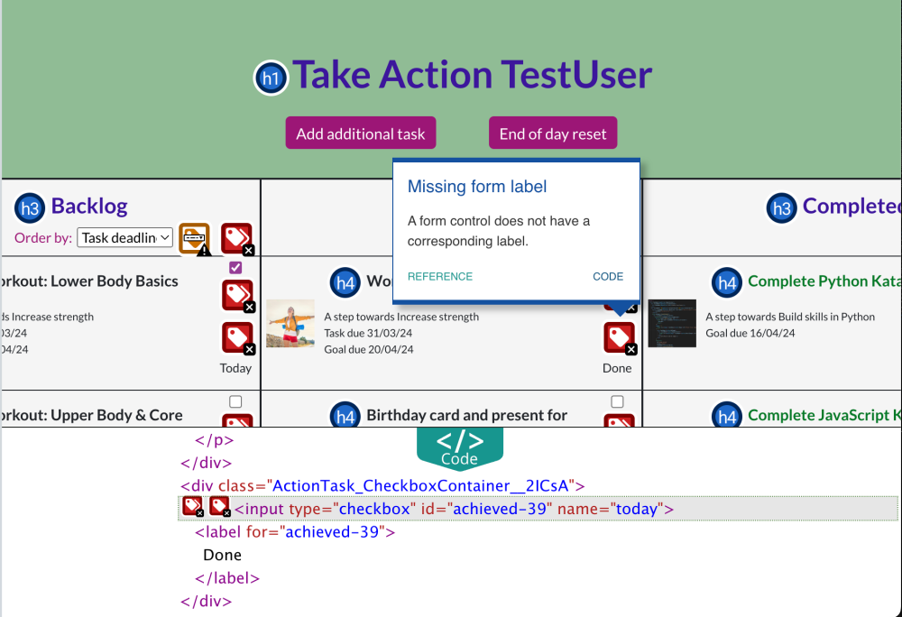
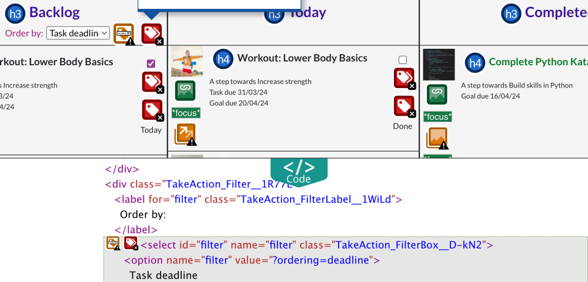
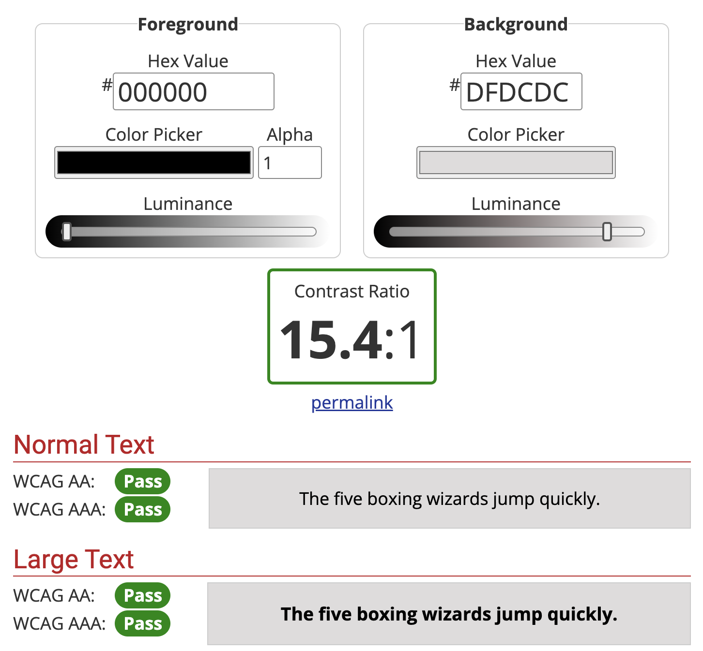
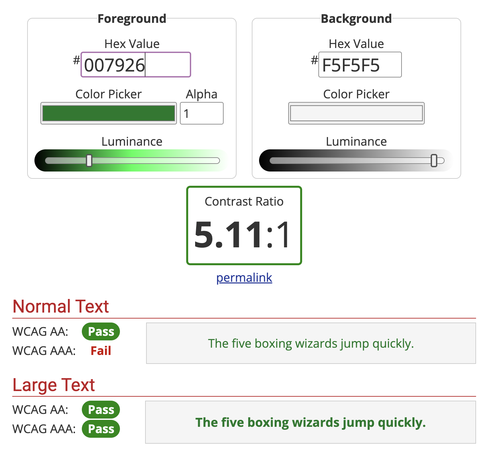
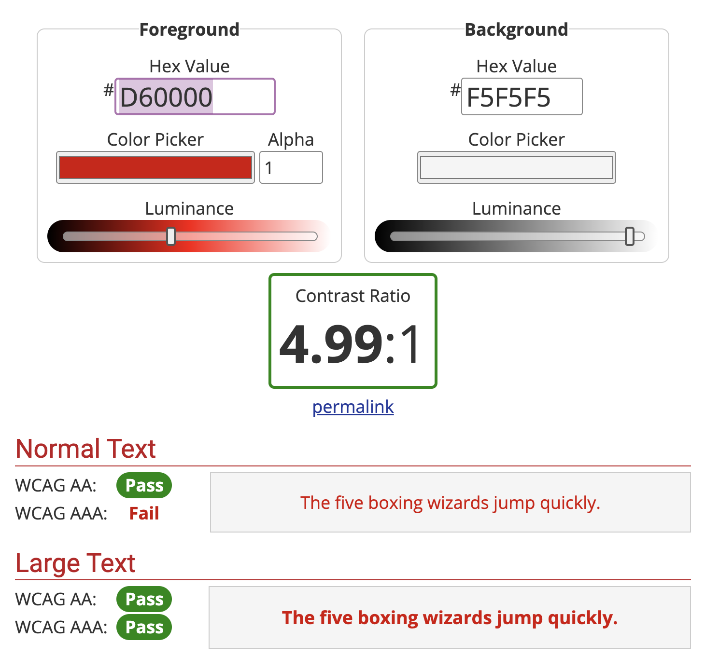
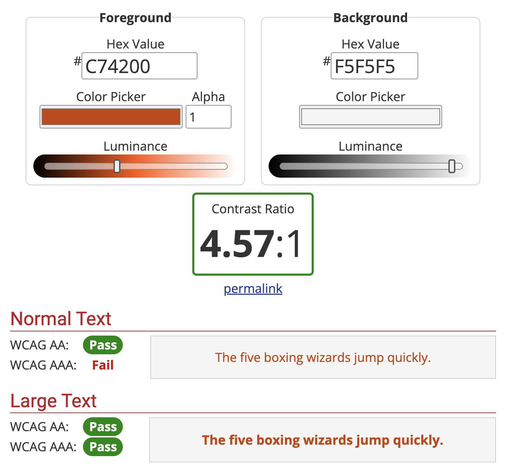

# Testing and Validation

## Contents

[Code Validation](#code-validation)

[User Story Testing](#user-story-testing)

[Form input testing](#form-input-testing)

[Accessibility Testing](#accessibility-testing)

[Lighthouse](#lighthouse)

[Responsive Testing](#responsive-testing)

[Compatibility Testing](#compatibility-testing)

---

## Code Validation

### CSS Validation

All css files have been passed through the [W3C CSS Validation Service](https://jigsaw.w3.org/css-validator/)

| CSS file | Result | Extra notes |
| --- | --- | --- |
| About.module.css | PASS | |
| Accordion.module.css | PASS | |
| ActionTask.module.css | PASS | |
| Button.module.css | PASS | |
| Cards.module.css | PASS | |
| FocusCreate.module.css | PASS | |
| FocusDesktop.module.css | PASS | |
| FocusMobile.module.css | PASS | |
| FocusView.module.css | PASS | |
| Footer.module.css | PASS | |
| Form.module.css | PASS | |
| Goal.module.css | PASS | |
| GoalCreate.module.css | PASS | |
| Miscellaneous.module.css | PASS | |
| NavBar.module.css | PASS | |
| Page.module.css | PASS | |
| TakeAction.module.css | PASS | |
| Task.module.css | PASS | |
| TaskCreate.module.css | PASS | |
| Toast.module.css | PASS | |

[Return to contents list](#contents)

### JavaScript Validation

EsLint was installed and in use during building of this project and has been used to validate all the JavaScript files, the majority of which also contain JSX. All files pass through the EsLint without warning.

[Return to contents list](#contents)

## User Story Testing

All completed user stories have been manually tested against their acceptance criteria. This has been documented below, organised by epic.

### Epic - New User Experience

| # | User Story | Acceptance Criteria | Result |
| --- | --- | --- | --- |
| 1 | As a new user, I can instantly see information about the application, so that I can understand the value that it may offer me. | Favicon of app logo | PASS |
| | | App Logo and name stand out as the main title | PASS |
| | | "Keep all your plates spinning" slogan stands out | PASS |
| | | Clear information about the app provided | PASS |
| | | Images display are specific to whether the user is displaying the page on mobile or desktop | PASS |
| | | Bottom of the screen takes user to the sign up | PASS |
| | | Footer provides info about development of the app | PASS |
| 2 | As a new user, I can find out more about the planning side of the application, so that I can learn more about how the application works enticing me to sign up. | Screenshots showing the plan page included. | PASS |
| | | Screenshots showing a focus area included. | PASS |
| | | Screenshots showing the miscellaneous area included. | PASS |
| | | Clear and concise explanation provided. | PASS |
| 3 | As a new user, I can find out more about the take action side of the application, so that I can learn more about how the application works enticing me to sign up. | Screenshots showing the take action page included. | PASS |
| | | Clear and concise explanation. | PASS |

### Epic - Navigation

| # | User Story | Acceptance Criteria | Result |
| --- | --- | --- | --- |
| 4 | As a user, a clear navigation bar is present throughout the site, so that I can navigate easily between different sections of the application. | Navigation bar fixed at the top of all pages. | PASS |
| | | Links are present to help the user navigate through the site. | PASS |
| | | The apps logo is displayed on the left and takes the user back to the home page. | PASS |
| | | On smaller screens the navigation links are accessed by clicking on a hamburger icon. | PASS |
| | | Navigation menu can be toggled off by re-clicking the hamburger icon or by clicking outside of the menu. | PASS |
| | | Navigation menu is automatically toggled off on the page changing. | PASS |
| 5 | As a user, the navigation bar contains links which are specific to whether I am logged in or logged out, so that all available links are relevant and accessible to me. | Non authenticated users should find: about, signup and signin in the nav bar. | PASS |
| | | Authenticated users should find: plan, take action and signout in the nav bar. | PASS |
| | | Non authenticated users trying to access (plan, take action and any of their nested routes) will be redirected to the login page. | PASS |
| | | All links should work as expected. | PASS |
| 6 | As a user, navigation between different sections of the website is seamless without un-necessary page refreshing, so that I can navigate quickly around the site. | Clicking on navigation links takes the user to the required section of the site. | PASS |
| | | No page refreshing occurs. | PASS |
| 7 | As an authorised user, all sub pages include an x that will return me to my previous page on clicking, so that I can easily check things out and then return to where I was. | When visiting a focus, miscellaneous, focuscreate, actionTaskCreate or daily reset I can see a clear x in the top right corner. | PASS |
| | | Clicking on the x returns me to my previous page. | PASS |
| 8 | As an authorised user, clicking on a task within the ‘take action’ page will take me to the ‘plan’ page where that task is located. | Clicking on the picture next to a task in Take action takes me to that focus area in the plan section. | PASS |

### Epic - Authentication

| # | User Story | Acceptance Criteria | Result |
| --- | --- | --- | --- |
| 9 | As a new user, I can easily set up an account, so that I can quickly get stuck into exploring and using the application. | A link to signup is present in the Navbar for non-authenticated users. | PASS |
| | | A call to action button to signup is present on the landing page. | PASS |
| | | Links take the user to the signup page. | PASS |
| | | Clear page title. | PASS |
| | | Sign up form with clear labels to aid completion. | PASS |
| | | Errors in form input fields are clearly displayed back to the user. | PASS |
| | | Successful completion takes user to the login page. | PASS |
| 10 | As a signed-up user, I can use my username and password to sign in to my account, so that my account remains secure and only I can login. | A link to sign in is present in the Navbar for non-authenticated users. | PASS |
| | | Link takes the user to the sign in page. | PASS |
| | | Clear page title. | PASS |
| | | Sign in form with clear labels to aid completion. | PASS |
| | | Errors in form input fields are clearly displayed back to the user. | PASS |
| | | Successful completion takes user to the home page, which welcomes them and provides call to action buttons to 'plan' and 'take action'. | PASS |
| 11 | As a signed-up user, I am the only one who can access my data, so that it remains safe and secure. | Current user data is accessible to all pages and components, so that everything is rendered appropriately for the current user. | PASS |
| 13 | As an authenticated user, I can easily logout of my account, so that I can keep my account secure. | Authenticated users are provided with a clear link to sign out in the navigation bar. | PASS |
| | | Clicking sign out will sign the user out and return them to the home page. | PASS |
| 14 | As an authenticated user, I can maintain my authenticated status until I choose to log out, so that I am not unexpectedly logged out due to expired access tokens. | Users are not unexpectedly signed out after 5 minutes. | PASS |

### EPIC - Focus areas

| # | User Story | Acceptance Criteria | Result |
| --- | --- | --- | --- |
| 17 | As an authenticated user, I can create focus areas, so that I can set out the different areas in my life that I want to use this app to support with and why each area is important to me. | Clicking the button to add new focus, within the plan page, takes me to the create focus form. | PASS |
| | | Title confirms I am in the correct place to create a new focus. | PASS |
| | | Form has clear labels to aid completion. | PASS |
| | | Errors in form input fields are clearly displayed back to me. | PASS |
| | | Successful completion creates a new focus and takes me to a page where I can add goals and tasks to my focus. | PASS |
| | | At any point I can cancel and return to the plan page. | PASS |
| 18 | As an authenticated user, I can edit a focus area, so that I can make changes should I wish. | When viewing a focus I can click on an edit button. | PASS |
| | | I can view my current focus details in a form. | PASS |
| | | I can edit each of the details. | PASS |
| | | Clicking to save updates my focus details and returns me to the focus view. | PASS |
| | | I can click cancel at any point to return to the focus view without saving. | PASS |
| | | I am informed of any errors in my inputs. | PASS |
| 19 | As an authenticated user, I can delete a focus area, so that I can remove information I no longer need or want. | When viewing a focus area there is a button to delete. | PASS |
| | | On clicking to delete I am presented with a confirmation message. | PASS |
| | | I can then confirm or cancel the delete request. | PASS |
| | | On cancel I am returned to the focus view. | PASS |
| | | On delete, the focus area is deleted and I am returned to the main plan. | PASS |

### EPIC - Goals

| # | User Story | Acceptance Criteria | Result |
| --- | --- | --- | --- |
| 20 | As an authenticated user, I can create goals that are linked to a focus area, so that I can set myself progression targets that are specific, measurable, achievable, reachable and time-bound, defining the value to be gained in achieving the goal. | When viewing a focus I can click an "Add Goal" button at the bottom of the goal list. | PASS |
| | | Clicking the button brings up a form to create a new task. | PASS |
| | | At any point I can cancel, hiding the form. | PASS |
| | | Submitting the form creates a new goal, with the goal appearing in its view state, as well as being added to the goal list. | PASS |
| | | I am informed of any errors in my input fields when submitting. | PASS |
| 22 | As an authenticated user, I can edit a goal so that I can make changes should I wish. | When viewing a goal I can click on a button to edit. | PASS |
| | | Clicking edit brings up the goal in a form. | PASS |
| | | I can edit each of the details. | PASS |
| | | Clicking to save updates my goal details and returns me to the goal view. | PASS |
| | | I can click cancel at any point to return to the goal view without saving. | PASS |
| | | I am informed of any errors in my inputs. | PASS |
| 23 | As an authenticated user, I can delete a goal, so that I can remove information I no longer need or want. | When viewing a goal there is a button to delete. | PASS |
| | | On clicking to delete I am presented with a confirmation message. | PASS |
| | | I can then confirm or cancel the delete request. | PASS |
| | | On cancel I am returned to the goal view. | PASS |
| | | On delete, the goal is deleted and I am returned to the main focus view with no goal selected. | PASS |

### EPIC - Tasks

| # | User Story | Acceptance Criteria | Result |
| --- | --- | --- | --- |
| 24 | As an authenticated user, I can create tasks linked directly to a focus area, so that I can set out day to day tasks associated with that area. | At the bottom of the day to day tasks for each focus is a form to create a new day to day task. | PASS |
| | | Submitting the form creates a new day to day task for that focus area with the new task appearing in the list of day to day tasks and the form emptying. | PASS |
| | | At any point I can click to cancel, which empties the form. | PASS |
| | | I am informed of any errors in my input fields when submitting. | PASS |
| 25 | As an authenticated user, I can create tasks linked to a goal, so that I can set out the steps I will need to take to achieve my goal. | At the bottom of the goal section is a form to create a new task. | PASS |
| | | Submitting the form creates a new task for that goal, with the new task appearing in the list of tasks for the goal and the form emptying. | PASS |
| | | At any point I can click to cancel, which empties the form. | PASS |
| | | I am informed of any errors in my input fields when submitting. | PASS |
| 26 | As an authenticated user, I can create unlinked tasks, so that I can include any tasks not directly linked to a set focus area or goal. | At the bottom of the miscellaneous area is a form to create a new miscellaneous task. | PASS |
| | | Submitting the form creates a miscellaneous task with the new task appearing in the list of miscellaneous tasks and the form emptying. | PASS |
| | | At any point I can click to cancel, which empties the form. | PASS |
| | | I am informed of any errors in my input fields when submitting. | PASS |
| 27 | As an authenticated user, I can edit a task, so that I can make changes should I wish. | All tasks viewed in the planning section of the site have three dots next to them. | PASS |
| | | Clicking on the three dots brings up a list of options including edit. | PASS |
| | | Clicking to edit transforms the view of the task into an edit form. | PASS |
| | | I can make changes to my task details. | PASS |
| | | At any point I can click cancel transforming the view back to normal. | PASS |
| | | Clicking submit edits my task and transforms the view back to normal with all changes in place. | PASS |
| 28 | As an authenticated user, I can delete a task, so that I can remove information I no longer need or want. | All tasks viewed in the planning section of the site have three dots next to them. | PASS |
| | | Clicking on the three dots brings up a list of options including delete. | PASS |
| | | On clicking to delete I am presented with a confirmation message. | PASS |
| | | I can then confirm or cancel the delete request. | PASS|
| | | On cancel I am returned to the task view. | PASS |
| | | On delete, the task is deleted and removed from the task list. | PASS |

### EPIC - Plan

| # | User Story | Acceptance Criteria | Result |
| --- | --- | --- | --- |
| 30 | As an authenticated user, I can view all my focus areas and their nested goals together on one page, so that I can see and manage the bigger picture of everything I have going on. | Title lets me know where I am | PASS |
| | | A clear button takes me to "Add focus" | PASS |
| | | All my focus areas and my miscellaneous area are clearly visible | PASS |
| | | On mobile an accordion makes it possible to see all the focus areas at once, with the option to expand and see more details. | PASS |
| | | Each focus area is displayed with name, why (if given), image and any nested goals. | PASS |
| | | Each nested goal is displayed with name, description, deadline and additional deadline near warning (if deadline is near). | PASS |
| | | On mobile name and image are always displayed, with further info in expanded view. | PASS |
| | | Each focus area contains a "Go" button to take me to the view for that focus. | PASS |
| 31 | As an authenticated user, I can view all the goals and tasks within a given focus area together, helping me to plan how I wish to move forwards in this area and everything that is need to achieve that progression. | Clear title lets me know where I am. | PASS |
| | | Clicking on the X in the top right takes me back to the main plan page. | PASS |
| | | Information about the Focus is clearly displayed at the top, with options to edit and delete. | PASS |
| | | All goals and day to day tasks linked to the focus are shown with options to add, edit and delete. | PASS |
| | | On desktop, the goal titles are listed with space to expand one of the goals, showing all information and nested tasks. | PASS |
| | | On mobile, day-to-day tasks, goals and their nested tasks are displayed in an accordion. | PASS |
| | | Borders, white spacing and titles clearly separate out the information. | PASS |
| 32 | As an authenticated user, I can view all my miscellaneous tasks together in one place, so that I can plan tasks that don't link to any of my focus areas. | A miscellaneous area is always visible in the main plan with the miscellaneous image, title and explanation of this sections purpose. | PASS |
| | | I can click to go into the miscellaneous area where I can see a list of all miscellaneous tasks. | PASS |
| | | An x in the top right can be clicked to take me back to the main plan page. | PASS |

### EPIC - Informed User

| # | User Story | Acceptance Criteria | Result |
| --- | --- | --- | --- |
| 33 | As an authenticated user, I receive a success message on creation, editing and deleting, so that I know my action was successful. | Every time I submit a form to create, edit or delete data a toast pops up. | PASS |
| | | The toast has a header of success. | PASS |
| | | The toast contains details of the action that has been performed. | PASS |
| | | The toast has an x that I can use to dismiss the message. | PASS |
| | | The toast automatically disappears after 8 seconds. | PASS |
| 34 | As an authenticated user, I receive a confirmation message on clicking to delete, so that I am made aware of any linked information that will also be deleted should I proceed and can avoid any accidental deletes. | On clicking a delete icon or delete option I am presented with a confirmation message that informs that any nested goals or tasks will also be deleted. | PASS |
| | | I am presented with the option to delete or cancel. | PASS |
| | | Clicking to cancel returns me to viewing the item in question. | PASS |

### EPIC - Take Action

| # | User Story | Acceptance Criteria | Result |
| --- | --- | --- | --- |
| 36 | As an authenticated user, I can view all active tasks together in a take action page, so that I can plan and organise my day. | I can access the take action page directly from a link in the navigation bar and also from a call to action button in the signed in homepage. | PASS |
| | | A clear title informs me that I am in "Take Action". | PASS |
| | | There are three clear sections - Backlog, Today and Completed | PASS |
| | | On mobile these sections are contained within an accordion where sections can be opened or closed | PASS |
| | | A section titled backlog contains all my active tasks. | PASS |
| | | Each task has an image specifying which focus area it belongs to. | PASS |
| | | Each Task also specifies the goal it is attached to (if this is the case) and any deadline information. | PASS |
| 37 | I can click to reset the Action page, deleting one-off completed tasks and returning everything else to the backlog, so that I can start afresh each day. | When in the Take Action there is a button called "End of day reset" | PASS |
| | | Clicking the button brings up a confirmation message explaining the reset process | PASS |
| | | Clicking to cancel removes the confirmation message and no changes are made. | PASS |
| | | Clicking to reset deletes all achieved tasks, sets today to false for all today tasks and removes the confirmation message with all changes visible. | PASS |

### EPIC - Backlog

| # | User Story | Acceptance Criteria | Result |
| --- | --- | --- | --- |
| 38 | As an authenticated user, I can view all my pending tasks within a backlog list, so that I can easily see everything to be done altogether. | Backlog contains all tasks | PASS |
| | | Message provided if no tasks available | PASS |
| | | Tasks are ordered by deadline | PASS |
| 40 | As an authenticated user, I can order tasks in the backlog by repeated, focus, deadline, most recent, least recent, day to day or goal, so that I can set up the backlog in a way that works for me. | In the backlog section there is a selection box to provide ordering of the tasks. | PASS |
| | | This sits under the title in desktop and at the top of the expanded backlog section in mobile. | PASS |
| | | Clicking on the selection box brings up a list of ordering options. | PASS |
| | | Clicking an option causes the backlog list of tasks to order accordingly. | PASS |
| 41 | As an authenticated user, I can quickly add new tasks to the backlog without needing to go through the planning page, so that I can quickly and easily add additional tasks. | When I am in "Take Action" there is a clear button to add an additional task. | PASS |
| | | Clicking the button opens an "Add New Task" Modal. | PASS |
| | | The modal contains a form to create a new task. | PASS |
| | | The form also includes a section to link to a focus area and if focus area linked a section to link to a goal. | PASS |
| | | I can then choose to cancel or submit. | PASS |
| | | Cancelling closes the modal. | PASS |
| | | Submitting creates a new task, closes the modal and my new task is visible in the backlog. | PASS |

### EPIC - Today

| # | User Story | Acceptance Criteria | Result |
| --- | --- | --- | --- |
| 43 | As an authenticated user, I can toggle tasks to work on today moving them into a today list, so that I can prioritise and organise what I want to achieve today. | A section titled today in the take action page contains all my tasks marked as today. | PASS |
| | | All tasks in the backlog have a today checkbox. | PASS |
| | | When the checkbox is toggled on the task also appears in the today column. | PASS |
| | | When the checkbox is toggled off the task is removed from the today column. | PASS |

### EPIC - Completed

| # | User Story | Acceptance Criteria | Result |
| --- | --- | --- | --- |
| 45 | As an authenticated user, I can toggle tasks as completed moving them to a completed list, so that I can see exactly what I have achieved. | A section titled completed in the take action page contains all my tasks marked as completed. | PASS |
| | | All tasks in the today column have a done checkbox. | PASS |
| | | When the checkbox is toggled on the task disappears from today and appears in the completed column. | PASS |
| | | The checkbox is also present in the completed column and when toggled off the task is moved back. | PASS |

### Epic - Tracking

| # | User Story | Acceptance Criteria | Result |
| --- | --- | --- | --- |
| 50 | As an authenticated user, where I have set a deadline, the app calculates how long I have left in easy terms (weeks initially and then days), so that I can make sure I meet my deadlines. | | This story has been adjusted, see below |
| 50 adjusted | As an authenticated user, where I have set a deadline and the deadline is close or overdue, this is clearly displayed, so that I can make sure I meet my deadlines. | When viewing a goal in "Plan" an extra message is included when the deadline is near or overdue. This message is highlighted in red. |PASS |
| | | When viewing a task in "Take Action" information is displayed about the tasks deadline and parent goal deadline, if these exist. | PASS |
| | | A specific message is displayed where the deadlines are overdue, today or tomorrow. | PASS |
| | | Where overdue this is highlighted in red. | PASS  |
| | | Where Today or Tomorrow this is highlighted in amber. | PASS |
| 51 | As an authenticated user, when my deadlines are near the associated tasks are highlighted, so that my attention is drawn to tasks that I need to prioritise in order to meet my deadlines. | | This has been covered in user story 50 |

[Return to contents list](#contents)

## Form input testing

| Form | Handles change | Handles errors | Handles submit | Success message |
| --- | --- | --- | --- | --- |
| Signup | PASS | PASS | PASS | PASS |
| Signin | PASS | PASS | PASS | PASS |
| FocusCreate | PASS | PASS | PASS | PASS |
| FocusEdit | PASS | PASS | PASS | PASS |
| GoalCreate | PASS | PASS | PASS | PASS |
| GoalEdit | PASS | PASS | PASS | PASS |
| TaskCreate | PASS | PASS | PASS | PASS |
| ActionTaskCreate | PASS | PASS | PASS | PASS |
| Task Edit | PASS | PASS | PASS | PASS |

[Return to contents list](#contents)

## Accessibility Testing

Chrome's extension [wave](https://wave.webaim.org/) was used to test accessibility along with:

- [WebAim contrast checker](#text-contrast-levels) click to see testing.

- [Lighthouse](#lighthouse) click to see testing.

### Wave testing

Wave testing screenshots are displayed below:

| Route | Specific view | Result | Extra notes |
| --- | --- | --- | --- |
| "/" | Home page for logged out user | No errors | Alert - nearby image with the same alt text due to the logo (with it's alt text) being displayed twice |
| | Home page for logged in user | No errors | Alert - nearby image with the same alt text due to the logo (with it's alt text) being displayed twice |
| "/signup" | Sign up page | No errors | Alert "A nearby image has the same alternative text" caused by the logo being used twice with the same alt reference. |
| "/signin" | Sign in page | No errors | Alert "A nearby image has the same alternative text" caused by the logo being used twice with the same alt reference. |
| "/plan" | Plan page | No errors | |
| "/miscellaneous" | Miscellaneous page with all tasks in view mode | No errors | Alert: skipped heading level |
| | Miscellaneous page with a task in edit mode | No errors or warnings for edit section | |
| | Miscellaneous page with a task in delete mode | No errors or warnings for delete section | |
| "/focus/create" | Create new focus page | No errors | |
| "/focus/:id" | Focus page with everything set to view | Form label errors for new task forms - both daytoday and goal | See below for further details |
| | Focus page with focus set to edit | No errors from focus area | |
| | Focus page with focus set to delete | No errors from focus area | |
| | Focus page with a goal set to create | Form label errors for goal create form | See below for further details |
| | Focus page with a goal set to edit | No errors from goal areas | |
| | Focus page with a goal set to delete | No errors from goal area | |
| | Focus page with a task set to edit | No errors for task edit form | |
| | Focus page with a task set to delete | No errors from task delete confirm | |
| "/takeaction" | TakeAction page | Form label errors for checkboxes and search and ordering filters | See below for further details |
| unknown route | Page not found page | No errors | Alert: Redundant link |

Note: All pages show an alert linked to the noscript element from index.html with contents: You need to enable JavaScript to run this app.

#### Wave Error explanations

Form label errors:
TaskCreate and GoalCreate forms within the focus page return missing form labels when wave is run. See [bugs](https://github.com/GeorginaCarlisle/take-control-frontend-app/blob/main/README.md#bugs-and-fixes) for how these errors were tackled. The images below show the errors and also show the generated html that clearly show that input and label are correctly linked. It is also to be noted that no form errors are picked up by lighthouse and so I believe the errors may be inherent to wave and not my code.

Task name input and label:

Task deadline input and label:

Goal title input and label:

Goal description input and label:

Goal criteria input and label:

Goal value input and label:

Goal achieved input and label:

Checkboxes in the "Take Action" page return missing form labels and multiple form labels. Each input label pair has a unque id and are correctly linked:

Ordering filter returns select missing label and multiple form labels. The label and select correctly linked, with this being the only element with this id:

Search filter returns missing label. In this case there is no label but there is clear placeholder text to indicate the role of this input.

### Text contrast levels

The majority of text contrasts meet the strictest criteria: WCAG AAA criteria for normal text.

The following meet the WCAG AAA criteria for large text but not normal text, and are only used for large text:

- Site title text in the header
- Page titles
- Task titles in take action checked as done

The following meet only the WCAG AA criteria for normal text, the size they are found on the site. These are used infrequently and while the colours were darkened it was felt that to darken any further would negate the role of these colours to highlight and stand out amongst neighbouring text:

- Red warning text
- Amber warning text

#### Header

Contrast levels for links in header:

Contrast levels for highlighted links in header:

Contrast levels for site title in header:

#### Main page

Contrast levels for page titles:

#### Inside page container

Contrast levels for normal text in page containers:

Contrast levels for title text in page containers:

Contrast levels for text in highlighted task ( on edit or delete):

Contrast levels for task title when highlighted as achieved:

Contrast levels for red warning text:

Contrast levels for amber warning text:

#### Buttons and icons

Contrast levels for buttons:

Contrast levels for buttons on hover:

Contrast levels for clickable icons:

Contrast levels for clickable icons on hover:

[Return to contents list](#contents)

## Lighthouse

Chrome developer tools Lighthouse was used to test the performance, accessibility, best practices and SEO of all views. The results are shown below:

| Route | Specific view | Desktop/mobile | Performance | Accessibility | Best Pracices | SEO | Extra notes |
| --- | --- | --- | --- | --- | --- | --- | --- |
| "/" | Home page for logged out user | Desktop | 86 | 100 | 96 | 100 | |
| | | Mobile | 61 | 100 | 96 | 100 | |
| | Home page for logged in user | Desktop | 71 | 100 | 78 | 100 | Third party cookies affecting best practices result. |
| | | Mobile | 59 | 100 | 78 | 100 | Third party cookies affecting best practices result. |
| "/signup" | Sign up page | Desktop | 99 | 100 | 96 | 100 | |
| | | Mobile | 94 | 100 | 96 | 100 | |
| "/signin" | Sign in page | Desktop | 99 | 100 | 96 | 100 | |
| | | Mobile | 95 | 100 | 96 | 100 | |
| "/plan" | Plan page | Mobile | 77 | 100 | 78 | 100 | Third party cookies affecting best practices result. |
| | | Desktop | 76 | 100 | 78 | 100 | Third party cookies affecting best practices result.|
| "/miscellaneous" | Miscellaneous page | Desktop | 92 | 98 | 78 | 100 | Third party cookies affecting best practices result. |
| | | Mobile | 76 | 98 | 78 | 100 | Third party cookies affecting best practices result. |
| "/focus/create" | Create new focus page | Desktop | 99 | 100 | 78 | 100 | Third party cookies affecting best practices result. |
| | | Mobile | 90 | 100 | 78 | 100 | Third party cookies affecting best practices result. |
| "/focus/:id" | Desktop | Focus page with everything set to view | 79 | 100 | 78 | 100 | Third party cookies affecting best practices result. |
| | | Mobile | 66 | 100 | 78 | 100 | Third party cookies affecting best practices result. |
| "/takeaction" | TakeAction page | Desktop | 79 | 100 | 78 | 100 | Third party cookies affecting best practices result. |
| | | Mobile | 76 | 100 | 78 | 100 | Third party cookies affecting best practices result. |
| unknown route | Page not found page | Desktop | 99 | 100 | 78 | 100 | |
| | | Mobile | 90 | 100 | 78 | 100 | Third party cookies affecting best practices result. |

Note: Only the views as first generated via a url route could be tested through lighthouse.

[Return to contents list](#contents)

## Responsive Testing

The platform has been fully tested across a range of screen sizes, from 350px upto 1920px. The results of this are shown below:

| Route | Specific view | Mobile | Tablet | Laptop | Large Desktop |
| --- | --- | --- | --- | --- | --- |
| "/" | Home page for logged out user | PASS | PASS | PASS | PASS |
| | Home page for logged in user | PASS | PASS | PASS | PASS |
| "/signup" | Sign up page | PASS | PASS | PASS | PASS |
| "/signin" | Sign in page | PASS | PASS | PASS | PASS |
| "/plan" | Plan page - mobile | PASS | PASS | PASS | PASS |
| | Plan page - desktop | PASS | PASS | PASS | PASS |
| "/miscellaneous" | Miscellaneous page with all tasks in view mode | PASS | PASS | PASS | PASS |
| | Miscellaneous page with a task in edit mode | PASS | PASS | PASS | PASS |
| | Miscellaneous page with a task in delete mode | PASS | PASS | PASS | PASS |
| "/focus/create" | Create new focus page | PASS | PASS | PASS | PASS |
| "/focus/:id" | Focus page in mobile with everything set to view | PASS | PASS | PASS | PASS |
| | Focus page in with focus set to edit | PASS | PASS | PASS | PASS |
| | Focus page in with focus set to delete | PASS | PASS | PASS | PASS |
| | Focus page in with a goal set to edit | PASS | PASS | PASS | PASS |
| | Focus page in with a goal set to delete | PASS | PASS | PASS | PASS |
| | Focus page in with a task set to edit | PASS | PASS | PASS | PASS |
| | Focus page in with a task set to delete | PASS | PASS | PASS | PASS |
| "/takeaction" | TakeAction page | PASS | On tablet the TakeAction grid is wider than the screen and scroll has been enabled | PASS | PASS |
| unknown route | Page not found page | PASS | PASS | PASS | PASS |

[Return to contents list](#contents)

## Compatibility Testing

This project was built and test along the way predominantly in a Chrome browser. Once the platform was completed and deployed testing was also carried out in the following browsers:

| Route | Specific view | Chrome | Safari | Firefox | Edge |
| --- | --- | --- | --- | --- | --- |
| "/" | Home page for logged out user | PASS | PASS | PASS | PASS |
| | Home page for logged in user | PASS | PASS | PASS | PASS |
| "/signup" | Sign up page | PASS | PASS | PASS | PASS |
| "/signin" | Sign in page | PASS | PASS | PASS | PASS |
| "/plan" | Plan page - mobile | PASS | Fail - Cannot access | Not tested | Not tested |
| | Plan page - desktop | PASS | Fail - Cannot access | PASS | PASS |
| "/miscellaneous" | Miscellaneous page | PASS | Fail - Cannot access | PASS | PASS |
| "/focus/create" | Create new focus page | PASS | Fail - Cannot access | PASS | PASS |
| "/focus/:id" | Focus page - mobile | PASS | Fail - Cannot access | Not tested | Not tested |
| | Focus page - desktop | PASS | Fail - Cannot access | PASS | PASS |
| "/takeaction" | TakeAction page in mobile | PASS | Fail - Cannot access | PASS | PASS |
| | TakeAction page in desktop | PASS | Fail - Cannot access | PASS | PASS |
| unknown route | Page not found page | PASS | PASS | PASS | PASS |

Please see [bug #2](https://github.com/GeorginaCarlisle/take-control-frontend-app/blob/main/README.md#bugs-and-fixes) for further details about Safari.

[Return to contents list](#contents)
