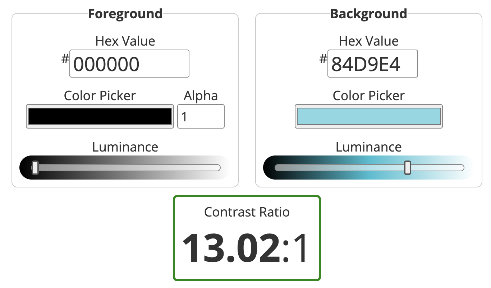

# Testing and Validation

## Contents

[Code Validation](#code-validation)

[User Story Testing](#user-story-testing)

[Automated Testing](#automated-testing)

[Accessibility Testing](#accessibility-testing)

[Lighthouse](#lighthouse)

[Responsive Testing](#responsive-testing)

[Compatibility Testing](#compatibility-testing)

---

## Code Validation

[Return to contents list](#contents)

## User Story Testing

[Return to contents list](#contents)

## Automated Testing

[Return to contents list](#contents)

## Accessibility Testing

### Text contrast levels

Contrast levels for main text:

Contrast levels for logo and section headings:

Contrast levels for interactive elements on hover:

Contrast levels for interactive elements:

Contrast levels for the footer:

Contrast levels for the alert main text:

Contrast levels for the alert title:

[Return to contents list](#contents)

## Lighthouse

[Return to contents list](#contents)

## Responsive Testing

[Return to contents list](#contents)

## Compatibility Testing

[Return to contents list](#contents)
